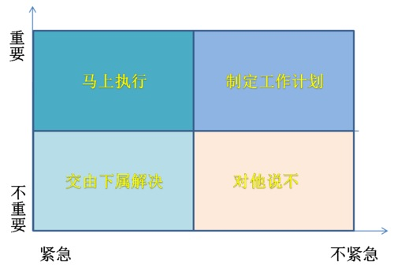

# 为什么我比你有时间

时间管理的基石是『四象限』：

我的案例可能不具备普适性：我每天五点四十左右起床，六点十分左右出门，大概六点五十的样子已经坐在工位上开始一天的事情了。所以我可以做事的时间自然比很多人多出来两三个小时。

## 有效地利用时间

当然，多出几个小时的时间并不意味着就可以高效地做事。这里我讲『做事』而非『工作』是因为这段时间我基本都不在工作（除了紧急事件或者开会）。这是很重要的，也是我想讲的第一条原则：

__有效利用时间的前提是将工作，学习和生活尽可能切割开。__

工作中我们经常遇到这种情况：工作很多，似乎总也忙不完。忙着忙着就到了中午，忙着忙着又到了下班时间。程序员又是很不情愿下班就马上回家的那群人（原因你懂的），所以往往继续工作一两个小时。

我曾经也是这种状态，尤其是创业的时候。后来我发现这样并非最高效的做法，因为当一件事情你投入过多时间，反而容易造成『慢慢来，我有的是时间』的效果。所以我说把工作，学习和生活切割开。最理想的情况是上午九点钟一到就立刻切换到工作模式，尽可能在八小时内解决当天的战斗，晚上六点下班就立即脱离开工作模式，再也不去想工作的事情。虽然，理想总会和现实产生冲突，但我们不能以此为借口妥协。

第二条原则是__制定每天的计划并尽可能按照计划行事。__这里说的计划并不是落在纸面上的todo list，而是脑海中的一个今日日程。这个说起来简单，每个人都知道，但真正履行起来不那么容易。我的做法是每天尽量在固定的时间做固定的事情。比如说我的日程安排是这样的：

* 早上6:50-7:50我一般在上课（coursera或网易公开课），看youtube视频，或者写代码。
* 7:50后开始发文章，看hacker news，看看各类文章等等。
* 晚上6:00到7:00我一般会研究某个技术，或者看书看杂志（我会不定期买书看，也定了一财等纸质杂志）。
* 9:00-10:30一般在写文字（没开公众号前写代码）。

如果能够将这种日程坚持几个星期，你就会发现自己逐渐形成一种惯性（坚持21天能够成就一种习惯） —— 你不用刻意去维持，下意识，或者说习惯，就会帮助你进入到某个状态。

当然一旦工作上的事情和这个起冲突，还是不得不先应付工作。毕竟有人给你付工资，所以紧急程度要大很多。

第三条原则是 __集中精力，专心做一件事。在此期间，尽可能地戒网。__ 集中精力做一件事非常重要，它决定了你单位时间的产出。大家一天的有效时间都差不多，在单位时间里产出越多，可用的时间就越充沛。我自己经常会找个会议室独处，就是为了避免各种打扰，让自己能够在一个安静地环境下最高效地做事。

集中精力的一个大敌是上网。互联网是人类最伟大的发明，也是最浪费注意力的发明。网上永远有看
聊不完的热点新闻，读不尽的各式小说，看不够的热辣剧集，刷不光的微博微信。如果做一件事情的时候还时不时上网看看这看看那，好容易聚集起来的精力一下子就被打散了。人的头脑就像计算机，contex switch需要花费大量的代码去保存现场和恢复现场，不断被打断只能让自己越来越低效。

我们的世界是由热力学第二定律支配着：如不施加外力，无序和混乱（熵）总在不停增加。熵是一种可怕的东西，你不能消灭它，只能尽可能控制它。

## 应对拖延症

拖延是生物的本能（趋利避害）。每时每刻，当我们面临困难和逃避时，我们不自觉地会做出更安逸的选择。

在我看来，拖延其实是一种外部依赖 —— 如果外部地刺激不够，或者不强，那么就会拖延下去，直到外部刺激变化。（当然还有一种是外部刺激太强，导致无法完成的焦虑，反而引发拖延，这是另外一个话题了，不在本文讨论之列）

稿子不到截稿的那一刻是不会写完的。

借的书不到归还图书馆的那一天是不会读完的。

一个项目，只要不定死发布日期，就一直会拖下去。

......

GTD，番茄时间法等某种程度上能够让你摆脱拖延症，更好地完成任务，但这些是『术』。

面对拖延症最好的办法就是自我独立，从精神上摆脱对环境的依赖。这是『道』。有独立的意识很重要，因为唯有自己才明白自己为何做某件事情，为何工作，乃至为何活着。没有别人能够帮你自我独立，也许也没有鸡汤可以醍醐灌顶。
