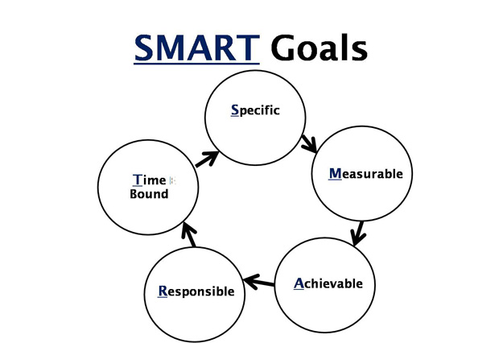

# 设定目标

有清晰明确的目标是我们每天生活的动力，（很可能）也是快乐的源泉。之前我年年为了减肥而跑步健身，可每次都是雷声大雨点小，体重还是不由自主地从七十出头滑到了八十。今年在同事的激励下，我设定了一个跑半马的目标，每天跑步的动力十足。原因是「减肥」意义太不明确，我又不是胖到令人发指，减到多少算是个头？所以对我而言这个目标不够好，所以我的动力相对弱一些。可跑半马不一样，全程二十多公里，今年十月份截至（北京马拉松），非常清晰明确。我的起点是什么样子我很清楚，每周需要什么样的进步也能掐着指头也能算得出来，所以我的动力很强，执行起来也快乐得多。以前以「减肥」为目标时，我每次跑完都会去过磅，一看，呀，没变化，坚持了一周下来一看还没变化，就气馁了。所谓一鼓作气，再而衰，三而竭。两三周下来就没有跑下去的勇气了。而以「半马」为目标，上周我能以9km的速度跑45分钟，这周我能跑55分钟，这就是进步。

说到这里，很多人都明白，这不就是 SMART 嘛？目标管理都说过的。好吧，我就不多说了，看图说话：

其中Responsible在正统的版本上叫 Relevant。

这里我对 "A" 有小小的异议。A一般被解释成 Attainable 或者如图中的 Achievable。我觉得这个说法现实中带着一点消极。如果我们的目标都是 achievable 的话，那你就失去了很多开发自己潜力的机会。我觉得 Aspired 或者 Ambitious 更好些。一个目标你要有渴望，有野心（雄心）才好，你的动力才足够强。对于公司里（系里，圈子里）的漂亮女孩子你说我一定要追到她，这是渴望；站在国图阅览室里说我一定要读完这一层的所有书，这是雄心。

有个「四分钟一英里」的故事我在前面的文章里讲过，其主人公就拥有打破「人类极限是四分钟跑一英里」的渴望。在被无数人讥讽不可能后，他成功做到了，也成功阐述了"Believe is self-fulfilling prophecy"。爱迪生有做出灯泡的雄心，这个目标在当时显然是unachevable的，但最终他改变了人类的文明史。

08年公司里一个叫SEDP（Sxx Engineering Development Program）的program，其目标是提升公司里工程师的各种能力。当时其中一个指标是Invention disclosure（简称ID，就是公司内部的专利机会，一个ID经审批通过后会走专利申请的流程）和专利申请的数量。我当时就很渴望发表一个美国专利（感觉很风光）。这在当时看上去有点难度，因为我所知道的公司里的几个华人大牛发表专利的也没几个（而且当时北京研发中心尚无人发表过ID，更别说专利了）。于是我咨询美国同事发表专利的详细流程，费了不少功夫把自己做的工作的专利机会抽象出来，写了一个ID。后来很幸运地，这个ID在公司内部审核通过，可以进行专利申请了。后来我觉得有一个专利申请说明不了问题，可能仅仅是运气。于是就订了个目标要发表至少10个专利目标。这个目标一直指引着我不放过工作中任何一个潜在的有价值的创意，在接下来的一年多时间，我写了好多个ID，最终有4个（包括和别人合写的）成为到专利申请。随着时间的流逝，现在已经有三个正式成为美国专利。虽然我已经有了不小的收获，但这一目标至今我还未完成，也还在为此努力着。

说这件事不是为了证明我有多牛，事实上我自己发表专利的过程中发现这原来让我仰视的事情也就那么回事，就是个流程，跟牛不牛没关。我想说的是，__有了一个你渴求的目标后，你的眼睛似乎一下子明亮起来，原来那些视而不见的东西突然间就跟目标有了联系。__ 如果我不想着发表专利，我无论如何也不会认为摆弄几个指针，做个局部优化提高一点点效率，最终能成为一个专利。

这就是我想讲的SMART，一个变种的SMART（A for aspired, ambitious）。

Aspired/Ambitious搞不好会让目标无法实现，我想这就是SMART的作者为何认为目标要Attainable。的确如此。我想当国家领导人这事显然不现实，我努力几辈子也努力不出来。但是，有很多看似不那么attainable/acheivable的目标其实只要一步步来，还是有机会的。就像跑马拉松，任何一个没有训练过的人直接去跑肯定会失败，甚至会付出生命的代价（猝死在跑道上）。所以对于这样一个不那么现实的目标，我们需要将其分解成一个个小目标，一点点达到。

我的前同事Keith说我一点也不像个工程师，还真是。几年前（还是和SEDP有关）我认为工程师向上的动力之一上来源于偶像级人物的现身说法。所以我突然萌发了采访公司创始人和CTO Pradeep同学的想法。这是个非常非常不现实的想法，它和我工作无关，我们之间级别相差太多，我个人也没有任何的采访经验等等。所有的一切都指向了不可能。

我将这个目标分解成了三步：首先我找一个认识的DE做采访，然后找我所在 BU 的CTO做采访，最后才是Pradeep本人。

我找到的DE之前打过几次交到，他本人又是IETF 可信计算工作组的联席主席，位高权重，是个很好的采访对象：一来我能攒够采访经验，二来他的经历很有吸引力。这次采访很成功，我又顺势邀请他给北京研发中心做个talk，他欣然同意。

和BU的CTO做采访我是打着SEDP的旗号，所谓王旗一挥，所向披靡 —— 这项目是他发起的，他必然要支持并「现身说法」。

有了以上两步的铺垫，我就有了充分的理由和样本。我跟Pradeep的秘书邮件里说明了来意，整个事情的意义（意义很重要），以及我已经完成的工作。后来顺利约到了半小时进行采访。

采访时有了之前的经验教训，我已经不那么紧张，也做足了充分的准备，整个过程波澜不惊。这就跟跑马拉松一样，当你做足了准备，最终的雷霆一击已经是顺水推舟的事情了。

最后，有了一个目标之后最好把它公布出来。有句话说的好："It's a dream, until you write it down, and then it's a goal"。我喜欢把我的目标说给我的LP听，家人听，甚至会放在博客里，公众号里这样公开的场合。__不管是什么目标，一旦你将其扩散给周围的人（可多可少），你完成目标的可能性就大了很多。__ 这看上去是个消极的做法，好像将目标分享出去有逼迫自己不得不完成的意思（否则别人会看笑话）。其实不然。分享出去的一大好处就是别人能帮助你出谋划策，给予指导（所谓三人行必有我师） —— 就像我跟同事讲我要跑半马后，他跟我分享了两个不错的公众号；当我跟大家讲我要跑半马后，有人就给我推荐了村上春树的书。所以我的私人目标我会分情况跟很多人，甚至包括同事和老板分享。工作和生活是密不可分的，有时候 __早一些跟你的老板分享你的生活目标更有助于工作与生活的平衡__。相信这一点，这是我的一个刻骨铭心的教训（现在不方便说）。

「把目标分享出去」的观点和 TED 的演讲 ["Keep your goals to yourself"](http://www.ted.com/talks/derek_sivers_keep_your_goals_to_yourself) 似乎相悖，我们来看看它说了什么。

这是个三分钟的演讲，短到令人无法信服。演讲者Derek解释当你将目标讲给别人听时，你会有 "good feeling"，而：

> good feeling now will make you less likely to do it... Social reality - mind is kind of tricked into feeling that it's already done. You're less motivated to do due to that satisfaction.

关于这个论点，我有好些疑问。就我个人而言（可能我是个特例），将目标跟别人分享时我没有 Derek 所说的让我不再有动力去实现目标的所谓 "good feeling"。真的一点没有。分享后我只收获了责任感，以及对方对我目标的质疑，肯定，或者建议。

我的另外一个疑问是：如果满足感就能让你停下或懒惰，那目标本身是否有问题？

我要跑半马，即使我有了 "good feeling"，有了满足感，我脑袋里都是跑完之后我的家人，我的宝贝女儿奔向我向我祝福的幸福场景，我也不觉得我会就此懒惰。相反，每周在跑步机上的时光，当我感觉自己无法坚持时，是脑袋里这种对达成目标后的愉悦憧憬让我坚持下去，一点点进步。

Derek 还举了心理学家的论证，但我反复阅读后发现，所谓「替代」的含义是 —— 当你的目标被别人注意到（acknowledge）时，你脑子里就好比这已经实现了。

我还是不太明白 acknowledge 在此的确切含义，也许不是我理解的意思。我为此专门查了词典：「承认；告知收到；公认；表示感谢；注意到」。似乎都无法用来正确理解这句话。我不知道读者们有无这样的经历 —— 当你说出你的目标后，听众对此报以热烈的回应，你就感觉它实现了？

我有些糊涂。也许是文化差异？我看了TED上的评论，支持和反对的声音都有不少。所以这看上去也不是文化差异。就我个人而言，我觉得Derek的这个三分钟的演讲完全不能说服我。所以我依旧会按照我的想法去行事。

不少目标我只分享给我最亲密的家人，有些目标我会分享给我的密友，还有些我会大胆地说给所有人听。分享的目的不是「靠别人来刺激你，别人越是否定你，你就越要拿出成绩来那些看不起你的人狠狠地煽一巴掌，看，老子也能成功」（某读者言），而是寻求建议和帮助。让我快乐的不是目标本身，而是在实践目标的每一步动作。

说了不少 SMART 原则中关于 A 的部分。我们再看看其他内容。首先，Specific 应该没有什么争议。一个特定的目标要远好过一个抽象的目标。一件事物描述得越仔细，我们大脑里对它形成的「视觉反射」越清晰。比如说：

> 迎面走来一个美女。

> 迎面盈盈走来一个身材高挑，一袭红裙的美女，粉腮红润，明眸善睐，嘴角藏着让人无法自拔的笑，像极了东方版的苏菲玛索。

哪个效果能给大脑更深刻的印象自不必说。

Measurable 也没有什么问题。不仅目标，我们做的任何一件事情本身都该是可测量的。可测量意味着我们能分辨目标是否一步步在达成的路上，同时也有助于通过测量的数据寻找经验，总结教训。比如我公众号 2014 年的目标「达到一万三的听众」（我很早前发文撰写过）已经实现，整个过程中的数据一直是我前进的动力。通过每日累计的数字我还可以分析（甚至预估出）出什么样的文章，什么样的话题能产生什么样的数字。如果你要考GRE，那么每周背多少个单词，写多少篇文章，做多少套真题，错误率逐渐控制到什么水平就是你需要考虑的测量手段。

Relevant 有点争议。wiki上说 "choose goal that matters"。有同学也在问：「如何衡量自己所设定的目标是否有价值？」我觉得这个很难有个答案，因为「有价值」是个很个人的事情，每个人心里都该有一杆秤。比如说：「争取在2014年把我的DOTA水平提升到中国区前50，能够进入WCG决赛圈」这就是个对我没有价值的目标，因为它跟我的还有点模糊的人生目标并不在一个方向上；但对于很多职业或者半职业选手而言，这是他们的梦。既然是很个人的东西，那就不要太在意别人怎么看，怎么想，追随你内心深处的那个声音（我也不知道该管它叫什么）走。我觉得一个人人格的独立意味着他形成了自己的思想和主见，不会人云亦云，能听取别人的想法，做出自己的决定，不会把自己的行为简简单单建立在别人的看法和喜好上。

Time-bounded 很好理解。一件事只要没有截止日期，就不可能完成。肯尼迪说美国要在60年代末实现把人送上月球的目标。在当时的条件下，这几乎是不可能。然而这个具有雄心又如此明确地像世界宣布了截止日期的目标最终实现了（我们且先不讨论登月是否属实，等「嫦娥」去证实真伪吧）。Time-bounded 如此重要是跟生物趋利避害的基因有关。只要有可能，我们就会找各种借口推迟目标的实现。因此，明确截止日期的目标要比没有截止日期的目标更早，更高质量地完成。

最后，说说若干目标之间的管理。从截止时间上分，每个人都有自己的长期目标，中期目标，短期目标；从功能种类上分，每个人都有自己的财务目标，生活目标，工作目标等等。各个目标间是一个协同的关系，而非有你没我的关系。我工作上要做出什么样的成绩和我今年要请个长假去台湾自由行（可惜由于马航的事件，家人对今年出去旅行有诸多疑虑）的目标如果管理得好，并不会产生冲突。相反，由于有了旅行的目标，我工作上会尽可能高效些，将事情安排开，和老板打好招呼，以便于最终出行的时候不会有任何耽误。

另外，大的目标，长期/中期的目标一定要分解成小的，短期的目标，一步步走。这有助于看到自己每天一点点朝着目标前进，从而保持心情的愉悦。当我每天都经历一次「行为 - 认知 - 情感」的正反馈时，当我看到自己对目标的渴求一点点变成现实的一部分时，我会为自己感到骄傲。这骄傲和别人的赞许、认同无关，完全是发自我的内心。当我发现自己无法坚持下去，很难达成一个小的目标时，我会去憧憬大的，或者长期的目标达成时的那种美妙的感觉，从而渡过难关。而当难关被抛在身后，成为又一个里程碑时，这进一步强化了我的「行为 - 认知 - 情感」的正反馈。
