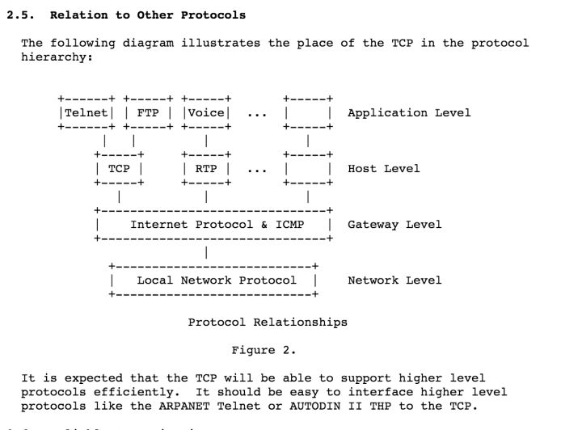
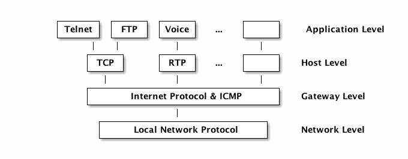
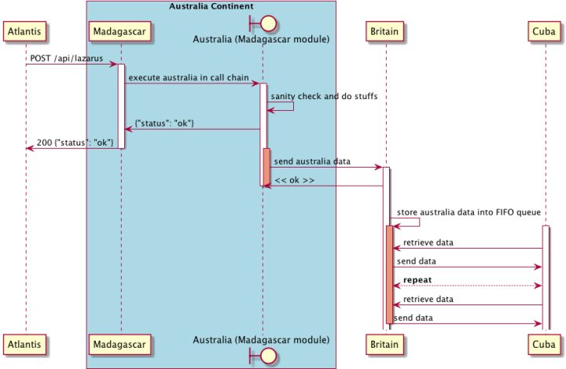
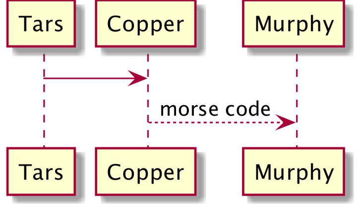
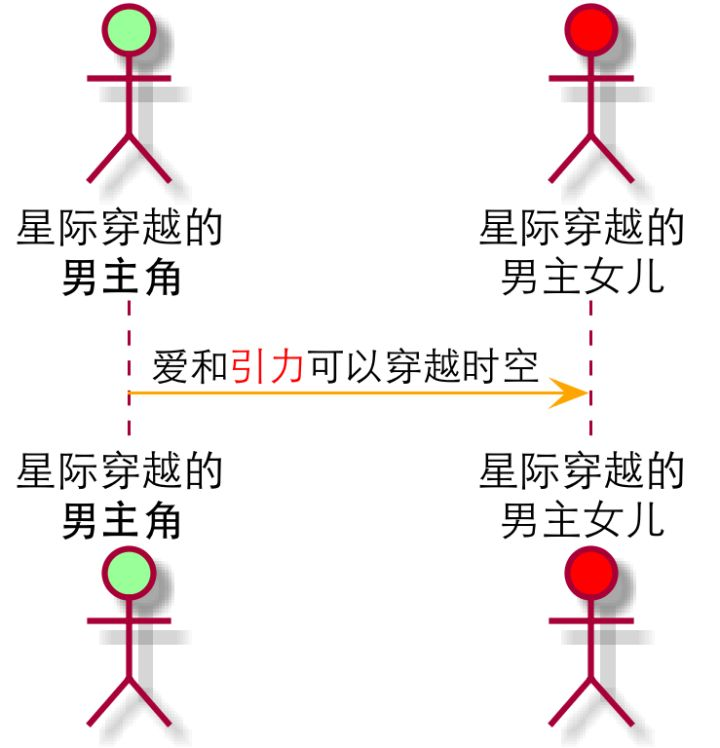
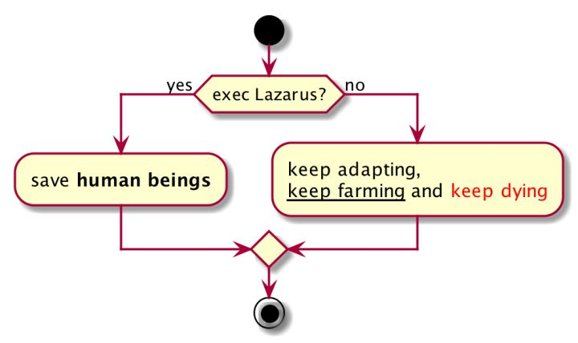
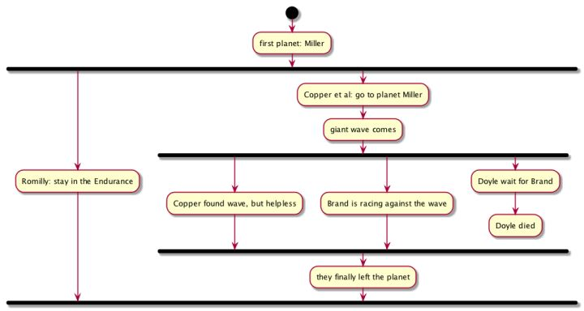
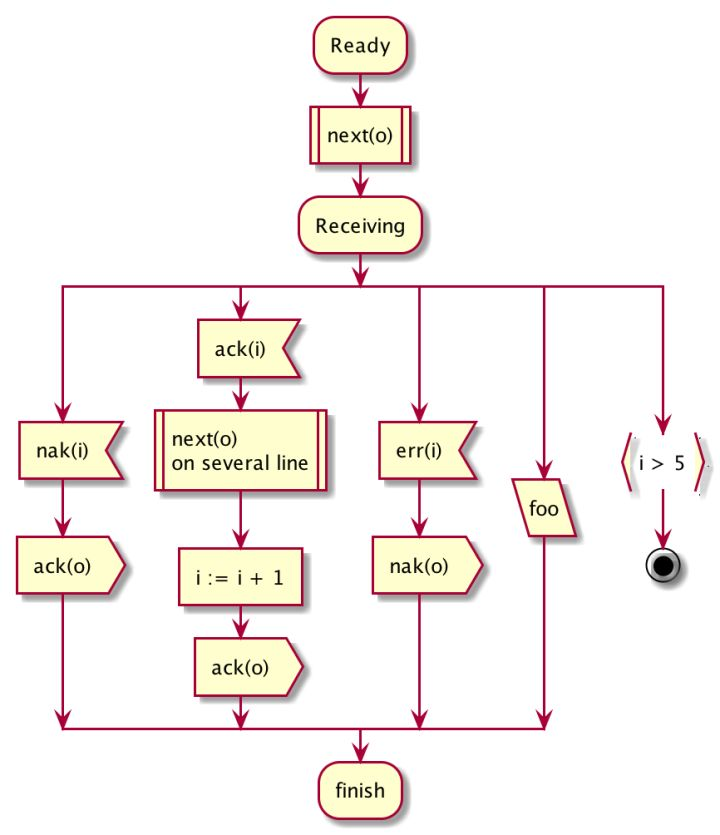

# 那些年，我追过的绘图工具

文档能力是一个工程师必不可少的基础能力，而高质量的文档往往伴随着高质量的图表。"A picture is worth a thousand words"，复杂的概念，逻辑，想法往往能够用图表清晰而生动地表达。一张好的图表离不开制作人的大脑对思维的描述，但同样离不开制作人所使用的工具。好的工具，让同样的事情事半功倍。我是一个工具爱好者，即便手头上有一个称心的锤子，我也会继续探索，寻求更好的钉钉子的利器。

## word

我最初接触的图表工具是word。从word 97开始，其内置的绘图能力就非常不错，能满足一般的应用。它的优势是简单易用，如果你使用word，那么不需要再切换到其它工具绘制，然后插入到word中。

## visio

接触visio，源自于word绘图时，可用的组件太少。因此如果想要提高绘图的效率，visio就成了软件工程师们的最佳选择。丰富的组件库，各种各样的图表支持，和word的无缝对接，是visio的强项。如果说visio最大的缺点，那可能就是无法在linux footnote:[也不全对，linux下可以用WINE] 和osx下运行。我周围的工程师们使用linux/osx的不少，但在绘图这事上，他们只好借助virtualbox这样的虚拟机工具，让windows下的visio重见天日。

## omnigraffle

三年前我把工作环境完全切换至mbp/osx后，经历了很长一段时间无法好好绘图的尴尬，我尝试过虚拟机的方案，但来回切换着实让人烦躁；后来我发现了omnigraffle，才结束了对visio的依依不舍。omnigraffle是osx下绘图的神器，各种各样的stencils满足你的几乎一切需求。有很长一段时间，做wireframe我都在使用它。bootstrap流行的年代，第三方的bootstrap stencils立刻跟进，满足我这个非处女座的小小处女座情节。

omnigraffle甚至可以打开visio制作的图表，这对visio迁移过来的用户是一大福音。然而，使用它的最大障碍是价格。普通版六百多人民币就足以吓倒一片人，更别说pro了。visio的话，公司可以申请安装正版软件，osx下就郁闷了，申请了两次，请求均被驳回。郁闷，只好离它而去。

## graphviz

和omnigraffle同步使用的，是graphviz。简单的语法，强大的绘图能力，还有跟sphinx footnote:[一款用reST写作的工具] 的结合能力，使其一度是我的最爱。

描述一个这样的状态机：

...

只需要这些DSL代码（dot language）：

```dot
digraph finite_state_machine {
    rankdir=LR;
    size="8,5"
    node [shape = doublecircle]; LR_0 LR_3 LR_4 LR_8;
    node [shape = circle];
    LR_0 -> LR_2 [ label = "SS(B)" ];
    LR_0 -> LR_1 [ label = "SS(S)" ];
    LR_1 -> LR_3 [ label = "S($end)" ];
    LR_2 -> LR_6 [ label = "SS(b)" ];
    LR_2 -> LR_5 [ label = "SS(a)" ];
    LR_2 -> LR_4 [ label = "S(A)" ];
    LR_5 -> LR_7 [ label = "S(b)" ];
    LR_5 -> LR_5 [ label = "S(a)" ];
    LR_6 -> LR_6 [ label = "S(b)" ];
    LR_6 -> LR_5 [ label = "S(a)" ];
    LR_7 -> LR_8 [ label = "S(b)" ];
    LR_7 -> LR_5 [ label = "S(a)" ];
    LR_8 -> LR_6 [ label = "S(b)" ];
    LR_8 -> LR_5 [ label = "S(a)" ];
}
```

这就是绘图语言的威力：只要你了解了大致的语法，你就能描述出标准的图表。很多时候，工程师需要绘制很多「标准化」的图表，用所见即所得的工具，你需要耗费大量的时间在「绘制」上，而使用绘图语言，你需要的时间仅仅是思考和敲键盘的时间。艺术细胞/美学基因在这里都不再是阻碍，只要你会思考，那产出便八九不离十。

我最喜欢用graphviz绘制的图表，除了状态机外，还有数据结构和函数调用关系。对graphviz感兴趣？点击：graphviz.org 开始学习吧。

## ditaa

在我工作的公司里，为了和IETF保持一致，很多文档都用txt格式书写，比如说这样（节选自rfc793，TCP协议）：

起初极其不适应 —— 要在80列的限制下用ascii表达图形，那是多么困难的一件事！后来，我渐渐习惯了这种表达方式，它让你抛弃一切花里胡哨，只关注最重要的部分。更重要的是，不要小看这种格式，它也能够被转换成「真正的」图形，被用在其它场合（比如说word里），这种转换工具就是ditaa。下图是ditaa将上图中的ascii图表转换后的样子：

是不是很赞？ditaa现在还是sourceforge上的一个项目，可以通过：http://ditaa.sourceforge.net/ 访问。

=== plantuml

最后，也是迄今为止我发现的最强大的基于绘图语言的绘图工具：plantuml。使用eclipse的童鞋可能早有所闻，甚至已经持续在使用这个工具，可惜，程序君一直是intelliJ的拥趸，所以直到前两天才得以一窥plantuml的强大。

先上一个图：

pla

描述它的语言并不复杂，对着图应该很快能看懂：

```plantuml
@startuml
participant Atlantis
box "Australia Continent" #LightBlue
    participant nginx
    boundary "Australia (nginx module)" as Australia
end box
participant Britain
participant Cuba

Atlantis -> nginx: POST /api/lazarus
activate nginx

nginx -> Australia: execute australia in call chain
activate Australia

Australia -> Australia: sanity check and do stuffs
Australia -> nginx: {"status": "ok"}

nginx -> Atlantis: 200 {"status": "ok"}
deactivate nginx

activate Australia #DarkSalmon
Australia -> Britain: send australia data
activate Britain

Britain -> Australia: << ok >>
deactivate Australia

deactivate Australia

Britain -> Britain: store australia data into FIFO queue
activate Cuba

activate Britain #DarkSalmon
Cuba -> Britain: retrieve data
Britain -> Cuba: send data

Cuba<-->Britain: **repeat**

Cuba -> Britain: retrieve data
Britain -> Cuba: send data
deactivate Britain
@enduml
```

plantuml，正如其名称，支持几乎所有的uml图，常画uml的童鞋有福了。比如class图：

更美妙的是，plantuml还集成了ditaa和graphviz，让你可以用各自的语法在plantuml下绘图，大有一统江湖之势。

和ditaa类似，plantuml也是一个sourceforge的项目，请访问：http://plantuml.sourceforge.net/。

我们接下来详细讲讲 plantuml。

plantUML支持如下UML图：

- Sequence diagram
- Usecase diagram
- Class diagram
- Activity diagram
- Component diagram
- State diagram
- Object diagram
- GUI Wireframe

这里面，我用的最多的是sequence diagram（序列图）和activity diagram（活动图），也就主要讲讲这两个图，其它的请自行阅读plantUML的文档。

### Sequence diagram

sequence diagram里每个角色被称为participant，participant之间可以有message，比如这样一个最基本的序列图：

```plantuml
@startuml                       // (1)
participant Tars                // (2)
actor Copper                    // (3)
database Murphy

Tars -> Copper                  // (4)
Copper --> Murphy: morse code   // (5)
@enduml                         // (6)
```

- (1) 声明一个图形的起始
- (2) 声明一个participant，可以省略
- (3) 如果想使用其它图例（不是participant），则不能省略
- (4) 声明两个participants间的消息， --> 为虚线， -> 为实线
- (5) 消息可以添加说明
- (5) 声明一个图形的结束

生成出来如下图所示：

相信不用解释，大家都懂。

你可以尝试将participant换成如下图示：

- actor
- boundary
- control
- entity
- database

会有不同的效果。如果你的participant的名字很复杂，可以使用 `as` 起别名：

```plantuml
@startuml
actor "星际穿越的\n<b>男主角</b>" as copper #99ff99 // (1) (2) (3)
actor "星际穿越的\n男主女儿" as murphy #red

copper -[#orange]> murphy: 爱和<font color=red>引力</font>可以穿越时空      // (4) (5)
@enduml
```

- (1) 可以给participant起别名，别名不必和显示的字符一致
- (2) 显示的字符可以使用\n等ascii控制字符，也可以使用html标签
- (3) participant可以在结尾赋一个颜色
- (4) message可以在 `-` 和 `>` 间插入一个颜色，以 `[]` 区隔
- (5) startuml支持中文，如果编译时遇到问题，请查看charset设置（设成utf-8）

生成出来的图表如下：

如果明白了这两个例子，咱们继续：

```plantuml
@startuml
scale 1024*768      (1)
[--> Tars: "They" provides data inside singularity (2)

activate Tars       (3)
Tars -> Copper: sending data
activate Copper

Copper -> Copper: translate it to morse code    (4)
activate Murphy

Copper -> Murphy: send morse code through watch

Copper -> Tars: ask for next batch
deactivate Copper   (5)

Murphy -> Murphy: record and parse morse code

Murphy -->]: figured out the formula    (6)

deactivate Murphy
deactivate Tars
@enduml
```

- (1) 我们希望生成的图片大一些
- (2) `[->`（注意中间不要有空格），传入到当前序列图的消息（participant不在该图中）
- (3)(5) `activate` / `deactivate` 用于指定participant的lifeline
- (4) participant可以发消息给自己
- (6) `->]`（中间不要有空格），传出当前序列图的消息（participant不在该图中）

生成的图表如下：

### Activity diagram

有了sequence diagram的基础，学习activity diagram易如反掌，直接上代码，不过多解释（程序猿应该对if else很熟悉了）：

```plantuml
@startuml

scale 1024*768

start

if (exec Lazarus?) then (yes)
    :find a livable planet;    (*)
    :save **human beings**;
else (no)
    :keep adapting,
    __keep farming__ and <font color=red>keep dying</font>;
endif

stop

@enduml
```

(*) 一个activity以 `:` 开始，以 `;` 结束。有了sequential diagram的基础，开始写activity diagram总会忘记后面的分号。

这个生成的图表如下：

来个进阶的：

```plantuml
@startuml

scale 512*1024

|Romilly|  (1)
start
repeat     (2)
    :record the data from black hole;
    :keep waiting;
repeat while (Copper & Brand are not back?)

|#AntiqueWhite|Copper| (3)

:enter the Endurance;

while (has more video tapes?)  (4)
    :watch it;
    :cry;
endwhile

end

@enduml
```

- (1)(3) 使用 `|` 创建带泳道的活动图，自泳道声明以下的活动都属于该泳道，泳道可以定义颜色
- (2)(4) 两种不同的循环方式，像不像写代码？

几乎一下子就能看懂了，是不？

继续进阶：

```plantuml
@startuml
scale 1024*768

start

:first planet: Miller;

fork        (1)
    :Romilly: stay in the Endurance;
fork again  (2)
    :Copper et al: go to planet Miller;
    :giant wave comes;
    fork
        :Copper found wave, but helpless;
    fork again
        :Brand is racing against the wave;
    fork again
        :Doyle wait for Brand;
        :Doyle died;
        kill    (3)
    endfork
    :they finally left the planet;
endfork         (4)

@enduml
```

- (1)(2)(4) `fork`，`fork again`，`endfork` 用来描述并发线程
- (3) `kill` 终结一个线程，plantuml的例子中使用 `detach`，经测试，`detach` 不可用

生成的图表如下：

最后，`;` 作为一个活动的终止，这是最标准的图例；如果将每个活动最后的 `;` 换成其它符号：`|`，`<`，`>`，`/`，`}`，可以显示不同的图例。不解释，具体看下述代码和对应的图表：

```plantuml
@startuml
scale 2
:Ready;
:next(o)|
:Receiving;
split
 :nak(i)<
 :ack(o)>
split again
 :ack(i)<
 :next(o)
 on several line|
 :i := i + 1]
 :ack(o)>
split again
 :err(i)<
 :nak(o)>
split again
 :foo/
split again
 :i > 5}
stop
end split
:finish;
@enduml
```

生成的图表：

