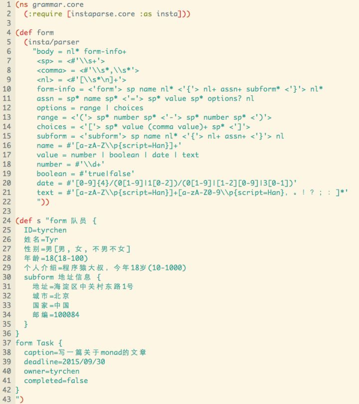
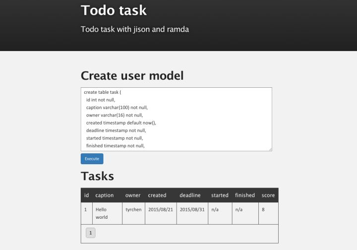
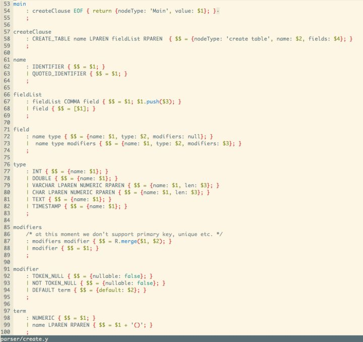
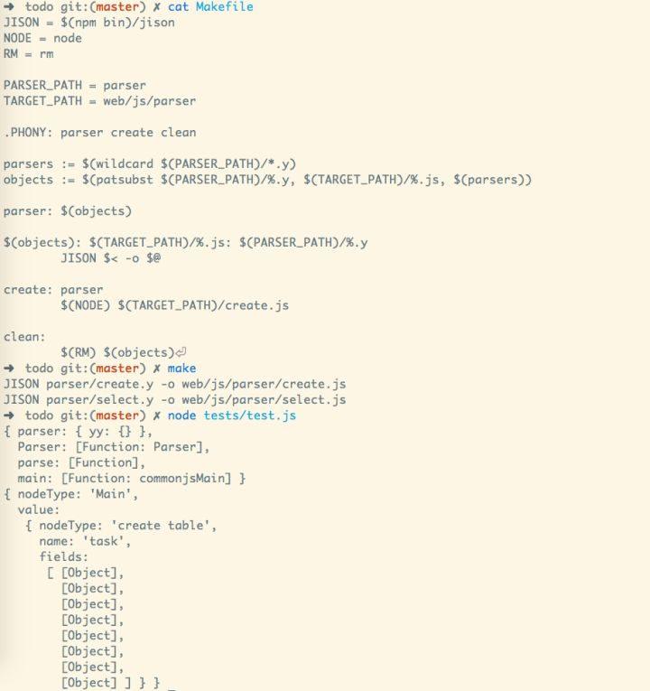
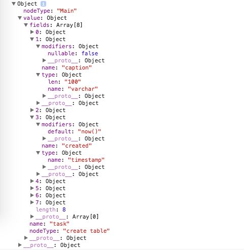

# 如何愉快地写个解释器

（一）

在前几日的文章『软件随想录』里，我随性写了一句：「现在似乎已经不是lex/yacc 或 bison/flex的时代了。我亲眼看见一个同事在费力地用perl一行行解析某个系统的数据文件，却压根没想到写个BNF。BNF对他来说，不是一种选择。」

很多同学不解，问我：lex/yacc不是写编译器的么？我又不发明新的语言，它们对我有什么用？

从这个问题里，我们可以见到国内本科教育荼毒之深。象牙塔里的讲编译原理的老师们，估计用lex/yacc也就是写过个毫无用处的toy language，然后把自己的一知半解传递给了他们的学生，学生们学得半通不通，兴趣索然，考完试之后便把死记硬背的内容如数奉还给了老师。

别笑，我还真就是这么过来的。我用lex/yacc干的唯一一件事，就是TMD设计一个语言。

这世间的语言如此之多，实在容不下我等庸人再设计一门蹩脚的，捉急的，没有颜值，没有性能的语言。况且2000年左右的时候还没有LLVM这种神器，也没有github这样的冥想盆去「偷」别人的思想，设计出来的蹩脚语言只能到语法分析这一步就停下来，没有任何实际用处。

后来lex/yacc进化成flex/bison，在工作中我也无意中翻看了一本orelley叫『Flex & Bison』的书，这书的副标题赫然写着：text processing tools。

书的内容还是挺教条的，和实际的工作内容略微脱节，可text processing tools这个说法戳中了我：是啊，词法分析 - lexical parsing（lex/flex），语法分析 - grammar parsing（yacc/bison）只是更好的文本处理工具（parser），是个高效处理带有语法的文本的DSL（Domain Specific Language）！它们和编译器没有半毛钱关系，只不过，它们的某一个应用场景是和编译器有关罢了。我们不必将其想得过于高深！

我们想想文本处理有什么工具？

Regular expression！

如今的编程语言，有哪个不支持regular expression呢？同样的，如今的程序员，哪个不用使用（没在代码里使用）regular expression呢？

Regular expression也是一种文本处理工具，也是个DSL，只不过，它处理不了复杂的语法。

我们知道，自动化理论（automata theory）里，有FSA（Finite State Automata）和PDA（PushDown Automata），前者可以用regular expression表述，而后者可以处理CFG（Context Free Grammar）。而CFG便是flex/bison要处理的对象！

遗憾的是，大部分语言都没有内置对CFG的处理，一旦文本处理的复杂度超过了regular expression可以表述的复杂度，我们便无能为力。举个例子，如果要你解析这样一段文本，你该怎么做？

```nginx
server {
  listen 80;
  server_name auth;
  access_log /var/log/nginx/auth.access.log;
  error_log /var/log/nginx/auth.error.log;
  location / {
    proxy_pass http://localhost:3000;
    include /etc/nginx/proxy_params;
  }
}
```

用regular expression自然是无能为力的，一个字符一个字符读入，按单词切分token，然后处理大括号，分号这样的语法，你相当于自己写了个解析器，很难保证高效和可扩展。所以这种时候我们需要求助于第三方的flex/bison，或者类似的工具。

flex是lex演进过来的，做词法分析。所谓的词法分析，说白了就是把文本切成一个个你认识的语法单元，比如上图里，`server` 就是这样一个语法单元，我们管这个单元叫token。

在flex里，我们可以这样描述上面文本里出现的token：

```flex
%%
"server"      {return SERVER;}
"listen"      {return LISTEN;}
"SERVER_NAME" {return NAME;}
...

"{"           {return OP;}
"}"           {return CP;}
";"           {return TERMINATOR;}
[\s\t\r\n]    {/* ignore */}
[A-Za-z0-9\.\/:_]+  {printf("%s\n", yytext); return VALUE;}
%%
```

接下来就是语法分析的环节了。语法分析做的是pattern matching的事情，和regular expression的pattern matching不同，它允许你定义一系列可递归的规则。标准的unix下，语法分析的工具是bison，我们看看上述文本如何使用bison解析：

```bison
%%

server:
  | SERVER OP exp_list CP
  ;

exp_list:
  | subexp exp_list
  | exp TERMINATOR exp_list
  ;

subexp: LOCATION path OP exp_list CP
  ;

exp: keyword value
  ;

path: VALUE

keyword: LISTEN
  | NAME        {printf("\t%s: ", "name");}
  | ALOG        {printf("\t%s: ", "access_log");}
  | ELOG        {printf("\t%s: ", "error_log");}
  | PROXY_PASS  {printf("\t%s: ", "proxy_pass");}
  | INCLUDE     {printf("\t%s: ", "include");}

value: VALUE
%%
```

其主体代码还是很清晰的，一个 `server {...}` 就用 `SERVER OP({) exp_list CP(})` 这样一条规则匹配，当解析器碰到 `exp_list` 这样一个它无法认识的内容时，它会寻找名为 `exp_list` 的规则继续匹配。如果你经常使用函数式编程语言，你会发现，这种规则的撰写似曾相识。

bison使用的描述规则的语法是BNF的变体。

以下是编译和执行的结果，作为展示，我仅仅把语法树中我感兴趣的内容打印出来了：


从上面的编译过程里，你可以看到，flex/bison是一个C语言的DSL。因此，你可以在处理词法和语法的过程中嵌入C代码，处理（transform）你需要的结果。DSL和宿主语言之间必然要有一些约定俗成的接口，这也是 `yytext`，`yyparser`，`yyterminate`，`yylex` 等等变量和方法存在的原因。它们看起来很奇怪，但如果你以一颗看待DSL的心去看待它们，变不那么别扭了。

（二）

可惜，如今大部分文艺青年都已经不用C了 —— 虽说很多语言都提供了对C的FFI(Foreign Function Interface)，比如Python，你可以用flex/bison生成一个parser，然后用FFI包装。然而，这毕竟很麻烦，如果我能用我喜爱的语言做parser，该多方便？

嗯，有需求的地方便有产品，看这个wiki page吧：https://en.wikipedia.org/wiki/Comparison_of_parser_generators。

我具体讲讲四个有趣的工具。

首先是clojure下的神器instaparse。instaparse是那种如果让你做个parser，不限定语言，那你一定要尝试使用的工具。别的工具一天能做出来的效果，instaparse一小时就能搞定。我们看个例子：



我们想parse满足一定规则的form，`form {...}`，form可以有subform，每行一个规则，每个规则是 `key=value [validator]`，validator是可选的，比如用 `[]` 括起来的是choices，用 `()` 括起来的是range。通过这个form，我们可以生成两种数据，一种是form的schema，另一种是form的data。所以关键的是，我们如何从form数据里解析出合适的数据结构，为生成schema和data做准备。

从上图里看到，使用instaparse，，仅仅18行代码，我们就可以完成lexer/parser的定义。instaparse支持EBNF/ABNF语法，可以很轻松地在生成的语法树中隐藏不需要的节点（注意 `<>` 的部分）。我们看生成的结果：


beautiful! clojure处理（transform）数据的能力非常强大，这样一棵树，可以很轻松地转换成一个DOM树（hiccup），然后生成html的form。。。

在instaparse里，写一个parser变成了三个简单的步骤：

- 使用BNF定义语法
- 隐藏不需要的语法节点
- transform生成的语法数

jiinstaparse的强大之处不仅仅在于简单的语法，还在于你可以使用REPL来调试你的代码！用REPL来调试你的代码！用REPL来调试你的代码！当你使用flex/bison在make和editor之间来回切换，郁闷地寻找语法定义问题的时候，你就知道一个REPL是多么地重要了！

当然，在我的读者里，目测clojure程序员相当稀有，所以，绝大多数人只能看着instaparse眼馋。

好吧，接下来我们讲讲jison。我想你应该猜到了，这货是javascript bison，bison在javascript上的变态。先来个解析SQL里的 `create table` 的例子。我们想实现这样的效果：



我们需要的是，如何把 `create table` 语法变换成一个数据结构，通过这个数据结构我可以很方便地生成一个html table。嗯，实现这个只需要写一个jison的语法文件（和flex/bison相似），然后用jison编译即可：







很简单有木有。这里我生成的解析树就是一个javascript object。然后我拿着这个object可以进一步生成一个如上图所示的table。

用javascript/jison做parser有什么好处呢？你可以在浏览器端做复杂的input validation，你可以允许用户输入符合你定义的语法的文本，然后生成想要的东西，比如思维导图，或者这个项目：https://github.com/bramp/js-sequence-diagrams。 如果你想定义一门语言生成javascript（我不建议你干这个），可以参考coffeescript，它 也使用了jison。

接下来我们讲一下另一个神器 antlr4。我也是在撰写这篇文章的时候才接触antlr4，还在第一次亲密接触中。出去解析器设计方面的与众不同 - LL(*) - antlr4对我而言，有三个强大的地方：

- 各种现成的语法定义（基本都是MIT/BSD license，跪拜吧，少年！）。打开这个repo：https://github.com/antlr/grammars-v4， 有没有想哭的赶脚？
- 生成主流程序语言的parser。嗯，你可以对着m4语法文件轻松生成python，javascript等的源码，然后集成到你自己的项目里。继续哭吧。
- SAX-like event driven。antlr4直接替你生成好了复杂的语法树 - 一般而言，antlr4生成的语法树没有使用instaparse/bison等生成的那么清爽，所以直接处理起来有些费劲，antlr4的创新之处在于：我先帮你生成好树，然后你可以随意遍历。就像SAX处理XML那样，每条规则（可以类比XML的每个Node）你都可以设置enter listener和exit listener，你把callback注册在你关心的节点的，antlr4会把上下文交给你处理。

由于antlr4有大部分的语言的语法定义，你可以把精力花在transform上而不是语法定义上。比如老板说：小明啊，把我司codebase里面所有超过100行的，里面没有一行注释的函数给我找出来，我要审审这帮不写注释孙子。

这种以前看上去无解的恶心需求，现在可能只需要一天就能搞定了：

- 假如代码是python3，找到python3的g4 file，用antlr4生成lexer/parser
- listen每个 `def` 规则，统计里面的有效代码数（不含空行），和注释数，如果注释为0，代码数超过100，把函数名和文件名，起始/结束行号记下来，然后用 `git blame` 找到作者，生成一个csv文件。
- 用excel打开这个csv，调整一下格式，通知里面出现的认识的每一个小伙伴和名字看上去像中文名字的人，让其把各自的代码赶紧加上注释，从名单里剔除（嘿嘿），然后聚合出来top 10 大坏蛋，饼图，柱状图什么的作为「表哥/表姐」的你随意
- 把excel文件发给老板

嗯，接受小伙伴的祝福，如果对方要请吃晚餐的话，不要拒绝，尤其是妹子（汉子）的。:)

好了，最后一个，parsec。parsec是个神器。一个我没用过但是要BB一下的Haskell下的神器。Haskell是门学了要走火入魔的语言，你看练斗转星移的慕容复在复国的路上疯了，练乾坤大挪移的张教主在革命的路上想不清楚选那个美人可耻地匿了就可以看出，如果满脑子里都装着composition，最会不可避免地看起来像精神病（大智若愚）。

上文所述的parser其实都是parser generator，generate出来的代码都是不可compose的，你写一个SQL parser，不能说先写一个select的parser，然后再写一个create table的parser，把两个compose起来，就是支持select和create的parser。你无法这么做。但parsec可以。在parsec里，你可以从一个很细力度的parser写起，一路将其compose成一个非常复杂的parser。当然，parsec已经替你完成了很多parser，你只需要定义一些新的，然后把他们和已有的compose起来就好。

这便是parsec所谓的 "A monadic parser combinator" 的意思。天，又是monad...monad我们放下不表，以后的文章再讲。

（三）

这篇文章并未告诉你LALR(1)，LL(1)，LL(*)等概念，没有具体解释lexical parser，grammar parser的详细步骤，虽然举了一些BNF（及其变体）的例子，也没有触及如何撰写BNF。这些内容很重要，但在你写一个parser之前，都是不打紧的内容。你需要知道的是，除了regular expression，你还有其他的工具处理更为复杂的带格式的文本。你应该了解了parser可能的一些应用场景，你也看到了一些主要的工具是怎么使用的，有什么优缺点。

你不必立刻放下手边的活去学习这些工具 —— 最好的学习方法之一是 learning by practising 而不是 learning by reading a book (manual)。下次老板让你做点和文本处理相关的任务，你只要记得，除了regular expression，你还有一些可以处理更复杂问题的工具就够了。接下这个任务，相信deadline的威力足以把你从小白变成一个大白。
