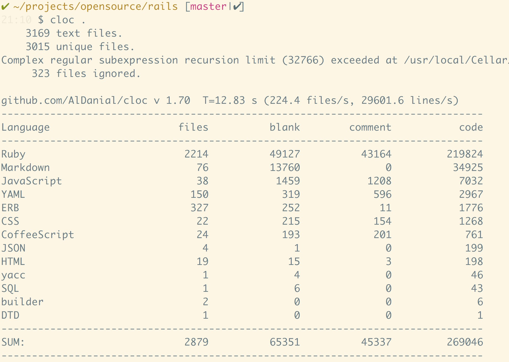
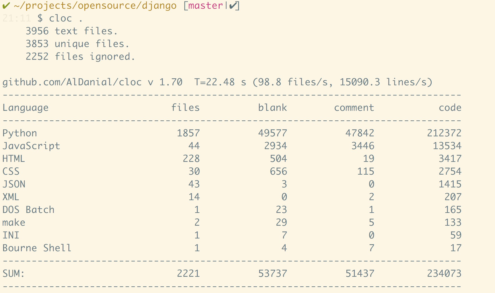
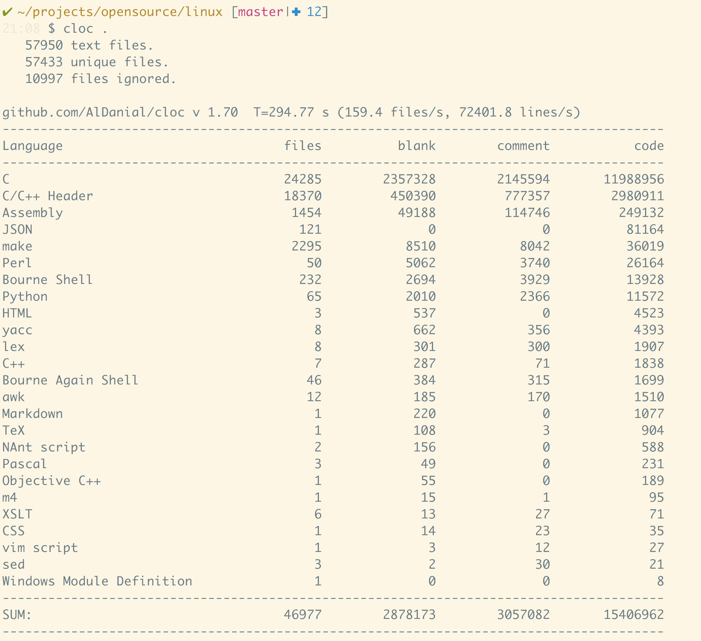
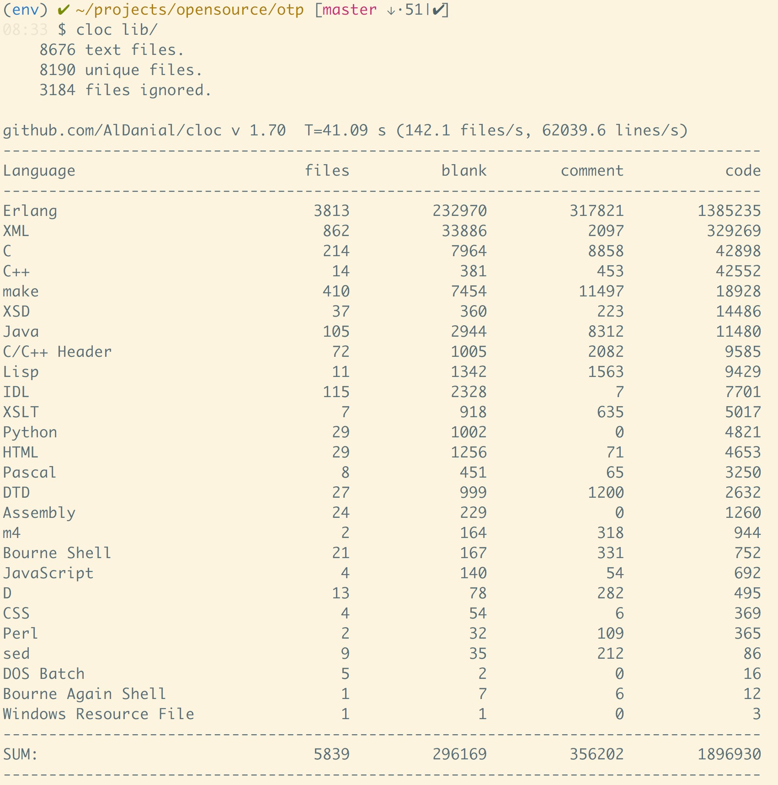
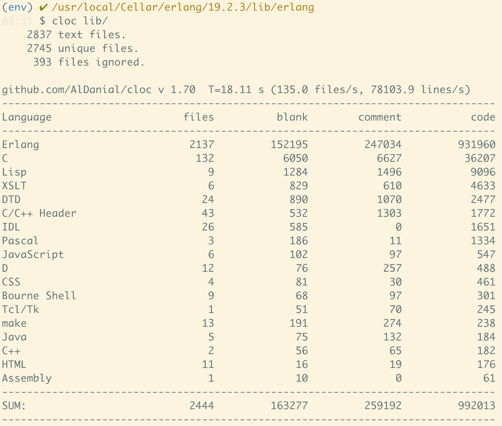

# 如何阅读一份代码？

上文谈到了像读书一样阅读源码的重要性，今天谈谈如何阅读一份代码。我所谓的一份代码，其范围可能从几千行到数万行，有时甚至可多达数十万行。这些代码作为一个有机体，共同完成某些重要的功能。比如说几个著名的 full fledged web framework，祖师爷 rails，师叔 django 和小师妹 phoenix：






三者对比很有意思 - rails / django 的代码数都在 200k 上下，而 phoenix 小了整整一个数量级，仅仅在 20k 左右。实现大致相同的功能，语言的表现力难道差距如此之大？这解释不通。实际上 phoenix 实现的功能，和 rails 对标，应该是 actionpack/actionview 两者加起来约 80k 的代码。而 rails 内嵌的 activemodel/activerecord 应该对标 elixir 的 ecto，恰巧又是 80k 比 20k。这种差异反映了语言表现力的差异，同时也体现了框架的成熟度的区别。

几十 k 体量的代码，就像一本不薄不厚的书，读着既不算太过吃力，也不至于读完意犹未尽。

有些巨型的代码库，如 linux kernel，块头堪比『战争与和平』，代码的规模宏伟到令人绝望，大大超过了我们能够阅读理解的范围。其结果是我们每每下定决心阅读，投入的巨大的精力，却像往一池湖水里投个石子，虽掀起一丝涟漪，但湖面很快就归于平静。



读不下来，我们也不要太绝望，可以分而治之，先定个小目标，每次读一部分，比如 scheduler（20k）或者 memory management（80k）。

在选定合理的代码规模和要阅读的源码后，我们就可以清开书桌，摆上 mac，准备好笔墨纸砚，留出至少一个小时到半天时间，开始徜徉在代码的海洋。

由于上一篇文章（）从头至尾将阅读书籍和阅读代码进行对比，很多人会不禁联想本文会否和『如何阅读一本书』进行类比，提供同样的思路：基础阅读，检视阅读，分析阅读，对比阅读。不错，这些读书的方法对读代码非常有参考价值，比如说检视阅读，我们读大型代码项目，也是类似的思路：

* 我们会读根目录下的 readme，或者任何看上去撩拨着你让你戳它的文件。这就跟书本的「序」一样，能够帮你更进一步了解这份代码的意图；
* 接下里我们目光需要聚焦在代码的目录结构，和每个源码的文件名。他们就像书本的目录页。如果每个目录下有 readme，也可快速阅读之。很多语言和框架，有约定俗成的目录结构（Convention by Contract），因此，通过目录我们就可以快速知道哪些是可以略过的部分，比如 django 的 ``management/commands`` 目录，elixir 的 ``mix/tasks`` 目录，这些目录，承载着支线剧情，需要的时候，或者闲得无聊时再读也不迟；
* 然后我们开始从入口梳理主线。不同语言和框架的主线不太一样，比如 C 的入口是 ``main()``，erlang/elixir otp app 的入口是 ``app:start``，nodejs 往往是根目录下的 ``index.js``，等等。一般而言，application 的主线比较清晰，一路下来，会走到一个 mainloop，而 framework 的主线会晦涩一些，因为 framework 往往是 application 抽象出来的部分。

但本文不会过多这样去对比 —— 大家真有兴趣，何不亲自读读那本书（读过的请带着读代码的角度再读一遍）呢？毕竟，它更加完备，更加系统。

我想通过另一个角度 —— 阅读的场景来谈谈如何阅读。谈到场景，很多人会联想到一本著名的书：Linux 内核场景分析。该书的作者显然把握了阅读代码的实质：循着一条线索，进行端到端的一个自成体系的内容的阅读。不同场景下，我们已知的信息，未知的信息，通过阅读想要达到的目标是不一样的，显然，方法也不尽相同。这就和读书一样：想要让自己明智，读史；想要让自己灵秀，读诗；想要让自己周密，研习数学；想要让自己深刻，攻读哲学等等。

接下来，本文就从若干阅读代码的场景开始，讨论个人的读代码的一点微不足道的心得。

## 场景一：为了破案而阅读代码

这是我们最主要的阅读代码的场景。工作中，免不了用各种各样的开源系统（别人的代码）。使用的过程中，你会遇到各种奇葩的问题，这些问题可能源于对文档的理解不够，或者从网上抄一个已有的，并不完全适合你使用场景的样例，或者是真的撞上了八阿哥。在想方设法解决的过程中，如果同事帮不上忙，google/stackoverflow 不够给力，论坛上各种「急，在线等」也无人理会，你会开始抓狂，仿佛被摄魂怪缠上了一般，生活中的各种美好，希望，都开始离你远去。

这时，你不得不像 CSI 中的警探一样，顺着一点蛛丝马迹，开始剖析代码，试图从迷雾中还原真相。你会抛开一切纷扰和杂音，集中精力，带着线索，循着问题，读且只读和解决问题直接相关的代码。这种状态，我管它叫「猎手模式」—— 我们有如非洲草原上追逐离群斑马的狮子，把身上燃起的小宇宙集中于一点，眼睛紧盯猎物奔走的方向，腿如疾风，势如闪电，心中不断地盘算着雷霆一击究竟用锁喉，打脸抑或拉后腿胜算更大。道路上的石子划了脚，痛；飞奔时撞上了幺蛾子，烦，但这都不是事儿。就算远远的乞力马扎罗山上难得地挂上了两道彩虹，煞是美丽，自拍后发朋友圈定能破百赞，你也无暇顾及这些并不重要的细节。

专注，集中力量攻击且仅攻击一点是这样场景下阅读代码的主要方式。

拿我遇到的 nginx cache 的问题来举个栗子。一年前，当我接手 Tubi TV 的性能较低且很难维护的 API 系统后，虽打定主意日后重写，但摆在面前的，刻不容缓的问题是提高性能。应用层可以施展的空间不大（数据已经在 redis 里），所以只能在 web 层打主意。在 HAProxy 和 nginx cache 之间，我选择了后者， 因为 nginx 已经在当时的生产环境下大量使用。我虽然没用过 nginx cache，但启用 nginx cache 并不是难事，照着文档设置好 cache 的路径和大小等参数后，在需要使用 cache 的 location 下，设置 cache key 并使能即可，我本地的简单的测试运行正常。然而，在生产环境中，本该命中的请求却一直处在 miss 的状态。我一筹莫展，尝试了网上搜到的各种方案无果。最终，我决定自己编译一个打开 DEBUG 开关的 nginx 版本（``--with-debug``），记录更多的日志，然后对着源码找问题。

nginx cache 及 upstream 里和 cache 相关的代码量并不算多，几千行，我快速过了一下，然后就着日志上的内容寻找相关的处理流程，并在几个大的 bailout 分支猜想可能出现的情景。由于 nginx debug log 还是不够详细到满足我的需求，我在这些没有被顾及到的分支上各自加了调试代码，重新编译，运行。

这个过程中，「猜」起到了很大的作用。我记得本科时的数学老师 —— 一个可爱的小老头 —— 点名提问对方答不上来时，常常挂在嘴边的口头禅是：你猜一下嘛。他总说连蒙带猜也是解题的一种思路，伟大的数学家同时也是伟大的猜想家。

我们读代码时，猜文件名，函数名，变量名的意图，猜某个分支的意图，猜某段代码的意图，最终结合运行的结果，打印出来的调试信息来印证我们的猜测。这是读者和作者间有趣的猫鼠游戏。读得越多，猜得越多，印证得越多，形成一个有效的 feedback loop（**read - guess - verify**），你下次猜测成功的几率就越大。

最终，问题被我定位出来 —— 它是两三处 configuration 未正确配置的问题。stackoverflow 上的答案是部分正确的，它解决了绝大多数人的问题 —— 没有 ignore cache control 相关的 header 几乎被每个初次使用者忽略了，它也是我的配置问题之一。但之所以这个答案没能解决我的问题，是因为我们生产环境中的 nginx 有个不起眼的配置 disable 了 proxy buffer，从而导致 nginx 直接跳过 cache。

从以上的过程中，我们抽象一下，看看为了破案而阅读代码要注意什么：

1. 带着线索，从一堆代码中找出和问题相关的代码。nginx cache 的例子中，线索是 proxy 的 upstream，cache 总不能命中，所以出问题的代码和 cache，proxy，upstream 有关。源码目录里一翻，就能挑出需要看的文件。由于问题在 cache 上，在挑出的文件中，具体看 cache 相关的函数名，宏名，以及代码。
2. 专注阅读挑出来的内容，忽略不相干的噪音。在阅读的过程中，着力寻找潜在的触发问题的路径，然后动用「我猜我猜我猜猜猜」大法，加调试信息。
3. 编译运行修改过的代码，复现问题，分析调试信息，然后，bingo，恭喜你答对了！请进入第 5 步。
4. 没答对，请回第 1 步。别急，这不是高考，在老板忍无可忍炒你鱿鱼之前，你一直拥有再来一瓶的机会。

还有个关键的第 5 步，我单拎出来说。很多时候我们轮回数次，终于在第三步 bingo 后快乐地像是刚刚 K.O. 了对手的春丽，夹着腿跳将起来，左右手在空中一齐比划着二，得意忘形，以至于忘记了执行第 5 步。

喜悦是短暂的，记忆也是短暂的。整个过程你的目标是如此清晰，执行力无比强大，为达到目的「不择手段」。三天后老板问你，小程啊，你很棒啊。你用了什么手段征服了这个无比难缠的八阿哥？这时你拼命追忆，却像拿筛子盛水，忙乱半天一无所获。你开始怀疑人生：三天前的我和现在的我究竟是不是一个人？

所以关键的第 5 步是：__复盘__。解决问题后，别着急接受同事们的致谢和女神（男神）的秋波。趁着记忆还冒着热气，抄起 evernote（或者 xxx），把整个过程用最简洁的方式记录下来 —— 关键代码，关键路径，到达终点的整个猜测过程，以及那些日志验证了猜测是对的，哪些日志验证了猜测走不通（恭喜你 —— console 或者 terminal 在这个时候应该还没关），总之，你在不择手段的过程中用过的一切手段，都应该像记流水账一样记录下来。最后分析总结：

* 这个问题的 root cause 是什么？触发它的代码的流程是什么？
* 在读代码的过程中，哪些地方我猜对了，哪些没猜对？
* 有功夫的话，代码的哪个部分是值得细细品读把玩的？
* 下次再出现类似的问题，我该怎么更快地从源码中定位出问题？

在这种「破案」般阅读代码的历程中，如果没有复盘，你 70% 的功夫白费了 —— 你花了不少时间，读了不少代码，除了一个好的结果外，并无太大的收获。可惜的是，绝大多数工作场景，我们都略过了这步。我自己也是（深刻检讨中）。写这个章节时，我搜了搜我的 evernote，翻了翻我的邮件，除了去年初有封邮件只言片语介绍了我使能了 nginx cache 外，再无其他记录。好在我当时解决完问题顺便又读了些 nginx cache 的代码，有些许印象，所以还能把它搬出来做例子。

复盘帮你把这样的信息沉淀下来，让你有机会回顾，进而组织和固化成上篇文章中所说的知识。这样的内容累积多了，慢慢你的头上就会顶起一个光环，光环上傲娇地写着：砖家。

## 场景二：为了明理而阅读代码

场景一所述的读代码方法是被动的，为了对付问题而读，是大部分人精进代码的唯一途径。这就好比英雄无敌里你就做个守成之主，收收矿，屯屯兵，从不主动招惹野怪，只等着敌人来进攻。这样三个月下来，就打了几仗，稳则稳矣，无奈经验值增长太慢。

要想涨快点怎么办？主动出击啊！计算机领域的很多算法，基础知识，理论，在看过书，读过文章后我们都似懂非懂，这时，阅读代码就是最快地巩固和加深理解的方式：

* 算法：bloom filter 究竟怎么实现的？gossip 协议实际的生产环境的代码是什么样子的？Linux kernel 如何实现 O(1) scheduler？
* 基础知识：一个完整的涵盖 HTTP 1.1 协议的 REST API framework 如何实现？一个 packet 从 OS 的 driver 是如何一路送上 application 的？什么是 zero copy？Linux kernel 如何实现 zero copy？
* 理论：啥是 IoC / DI / Pub Sub？各种 framework 都是咋实现这些设计模式的？supervisor 这个 behavior 背后的实现是如何的？

这个过程是一个正反馈，是马太效应累积地过程。你读的书多，你脑子里的知识点就多，疑问同样也多。这些疑问促使你读相关的代码去印证和解惑，代码读多了，又感觉理论知识欠缺，于是周而复始，不断学习下去。反之，书读得少，你脑子里都没存几个问号，也就无所谓读代码去求证了。

以 REST API framework 为例 —— 两年前我还在 Juniper 做 web security 时，读了 RFC 2616 及其后续的修订（7230-7235），当时苦于没有好的 API framework，我正好在研究 clojure，所以拿了 liberator 来看。Liberator 受 erlang 下的 webmachine 启发，用简单的 macro 把 decision tree 实现的无比优雅。后来我又扫了下 webmachine 的 decision tree，pattern matching + 递归，非常漂亮。可惜当时我在的团队思想比较僵化，眼里只容得下 python。无奈我退而求其次，选用了 eve，一个 python 下的 rest API framework。eve 的代码质量中规中矩，平铺直叙，明显像是你我写出的代码的模样。

详细讲讲我读 webmachine 的过程。我读 webmachine，完全是 liberator 的引荐，liberator 的作者说其 decision tree 来自于 webmachine，并附了图。这时的我就像刚练了李小龙的截拳道，听闻这功夫源自咏春，一下子就心痒痒欲探探咏春的虚实了。

webmachine 的代码很短，只有 4700 行。循着文件名很快就能找到 ``webmachine_decision_core.erl``，这是要阅读的主体内容，约 800 行。这 800 行代码，我们可以将其分成三个部分：头 150 行，decision tree 的架子；中间 300 多行，是具体的一个个 decision 的实现；剩下的两百行，是辅助函数。

每个 decision 的流转见下图：


这里 atom 的命名完全跟着图走，比方说 v3b13 这个 atom，含义是 v3 版本的图，b 列 13 行的 decision node。这是第一个 decision，如果 service available，则整个 flow 继续往下走，否则返回 503 service unavailable。

明白了这一点，按图索骥，代码的执行流程非常好懂。接下来的事情就很简单了 —— 顺着流程一个一个看 decision node 的代码，RFC 2616 变得鲜活起来，在你眼前跳动。我们再看一个例子：precondition check，是 v3g11：

```erlang
decision(v3g11) ->
    ETags = webmachine_util:split_quoted_strings(get_header_val("if-match")),
    decision_test_fn(resource_call(generate_etag),
                     fun(ETag) -> lists:member(ETag, ETags) end,
                     v3h10, 412);
```

这段代码从 http header 里读出 ``if-match`` header 里的 etags 列表，然后通过 ``resource_call`` 调用 ``generate_etag``，来生成 etag，和 etags 里的任意一项匹配，如果匹配，跳转到 v3h10，否则 412 preconditional failed。webmachine 怎么知道如何生成 etag 呢？这便是 framework 的功力了，它抽取并实现协议的公共的部分，而将业务逻辑延递给使用 framework 的 application。换句话说，``generate_etag`` 是 application 要实现的 callback。这便是 IoC。

这个代码解释到这里，明白 HTTP 协议中 etag 作用的人，或者对 concurrency control 方案清楚的人自然一目了然；但我相信不少人会很难理解它的应用场景。再进一步解释一下：比如小明和小红是程序人生的两个管理员，他们通过 API 同时从数据库中获取到程序人生的基本信息（名称，描述等） v1。小明把程序人生的名字改成了「序员人生」，调用 PUT API 成功修改数据为 v2。小红也同时修改这个数据，但她还是使用原有的 v1 的数据进行修改，结果提交时把小明的修改覆盖了。这是个 concurrency control 的经典场景 —— 令人谈虎色变的 race condition。怎么办（想想你平时怎么处理）？HTTP 协议的处理办法是：小明和小红拿数据的时候，同时拿到一个「版本号」（你就想象成数据的 sha1)，这里管它叫 etag。小明更改后，数据的 etag 变了，小红拿旧的 etag 提交时，服务器一检查当前的 etag，不匹配，于是便 412 了。这是一个简化了的 optimistic lock。

拉拉杂杂说这么多，只想说明一件事：能够读懂代码，和理解代码的应用场景是两码事。但是当你真正理解之后，你的代码功力就大涨。日后做并发环境下的共享对象更新，你脑袋里会闪个问号：吓，这里可不可以不用 lock（pessimistic lock），而是考虑类似 If-Match 的机制呢？

言归正传。之前的整个过程，我都在理解作者的意图。心满意足后，我一般会问问：

* 这代码有可以优化的地方么？
* 有潜在的安全漏洞么？
* 是否有未处理的状态或者异常？

这短短五行的代码，``lists:member`` 是个 O(N) 的操作。O(N) 的操作都该引起我们的注意。我们知道，membership check 用 set 而非 list，效果更佳。从安全的角度讲，split 出来的 ``ETags`` 是个薄弱环节。攻击者可以构造足够大且复杂的 ``if-match`` 头，来扯慢单个 request 的处理，从而达到更好的 DoS 效果。至于未处理的状态，这里可以放心 —— 有了上文中所示的如此详尽的流程图（状态机），这代码不会有大的问题。

OK，这栗子炒的时间够长了，打住。我们对比一下三个 API framework 的代码量：liberator 1.2k，webmachine 5k，eve 12k。读 liberator 的感觉像是楚辞，优美但晦涩；读 webmachine 的感觉像是数学教材，满纸都是递归推导；读 eve 的感觉像是读本科生的论文，完成了功能而已，读完没啥印象，倒是有些反面教材：整个 framework 写得太死，一些本不该 framework 做的决策被做了，以至于要满足我们的某些需求，最终只能通过 fork 它改 framework 的代码来完成，而这是 framework 的大忌（我们当时用的是 0.4，写本文时是 0.7）。

我们总结一下 —— 为了明理而阅读代码的方法并不太难：

1. 先使用前面所述的检视阅读法把整个代码过一遍，找到值得阅读的核心代码。
2. 粗读这部分代码，将其内容进一步 breakdown。手边准备好笔和纸（或者其他趁手的工具），随时记录。记录最好的方式是图表。这个阶段的记录不建议用软件工具（除非有用着特别舒服的，能够人件合一的）。
3. 精读这部分代码，结合你已有的知识，理解这个代码所需要的资料，猜测和还原代码中某种事件，消息，或者某个流程发生的场景。把猜测记录下来。这时，如果遇到外围的代码（调用了外部的函数），只要对理解不产生障碍，可以先放一下，把整个过程完整而详细地捋一遍再说。这个过程一定要多问问题，把「我以为我懂了但实际没懂」的情形尽可能减少。
4. 用检视阅读法粗度剩下的代码，如果找到其他值得精读的代码，跳至 2。
5. 使用对比阅读（或者说，主题阅读）方式，把类似功能的 repo 都扫一遍。尝试着用自己的语言消化不同作者的实现，关注其实现的差异，并试图评判这种差异。
6. 用软件将手稿电子化，便于将来回顾。文字可以直接上笔记本工具（甚至可以尝试 gitbook），图表如果买不起 visio，omniGraffle 这样的工具，可以用。使用方法参考我的文章：如何 xxx

最后一步是个非常耗时的过程，除非你有惊人的毅力，或者好为人师，要把你的心得分享出去，否则，做的动力不大。当然，在这个场景下，我们是悠然自得地读代码，没有客户老板拿着鞭子在后面抽，所以读懂之后记忆会非常深刻，即便没有电子文档留存，回到代码翻一翻，记忆就能还原了。

再次反省：我第 6 步也做得不好，有些手稿，如果不拍成照片，就永远的丢失了。

这样的阅读做得越多，真正搞明白的理论，知识和算法越多，你就越是不可替代的大拿。有时候，其实我们只要认认真真花上几个月，搞明白某大型项目，基本就是人中龙凤了。

## 场景三：为了能级跃迁而阅读代码

中学物理告诉我们：原子在光的辐射下，吸收光子，可以从低能状态跳跃到高能状态，电子的轨道，或者说能级（energy level）会发生跃迁。这和哲学上常常提到的量变到质变异曲同工。作为一个程序员，你的发展历程也是这么一个过程：在工作中缓慢爬坡，到达一个平台便停滞不前，似乎股票走势上的箱体整理。然后突然有一段时间，不知道受了什么刺激（比如说野战打出了龙王神力，或者说读了程序人生\*\_\*），突然连拉几个涨停上了另一个平台。

打破平台期，成就能级跃迁，你需要吸收合适的「光子」。这光子可以是一个开天辟地的项目（比如说 Google 的 Google Map，docker 的 docker，阿里的淘宝等），可是这样的机会并非总能被你我赶上，大多数人都是在日复一日地做些并不起眼的，只能缓缓升级的小活 —— 就像一个七级的英雄带着一群大雕，却只能天天怼大耳怪地狱恶犬狮鹫之流的野兵。这时候，与其默默沉沦，不若学庄子口中的北冥之鱼那样，沉潜浮动，积蓄能量，等待下一次抟扶摇而上九万里。

这种积蓄能量为跃迁准备的一种方式是读代码。读什么？读那些基础地不能再基础，你认为自己一辈子都不会去写的那些代码。比如 linux kernel，比如 OTP。这种读法，你不知何时能够完成，所以，要有足够的耐心和时间。检视阅读 + 主题阅读 + 思维导图是经常用到的方法。下图是 OTP 的源码我在检视阅读后，圈定的要逐渐阅读的部分，加粗的是我已经完成粗读的部分。


OTP 的代码不算少，但是耦合度非常低，其实最终是拆分成若干个场景二去阅读。我们看其代码总量：



1.4m loc，近乎恐怖。但除去 example 和一些无关的辅助代码后：



930k，小了约 45%。而我圈定的第一批阅读的代码，只有区区 130k 而已，不消两天可以粗读，顶多半年，可以精度。如此这般，半年后，你的水平必然非当日的吴下阿蒙了。

这种阅读有时会让人非常沮丧，因为你会遇见非常非常之多的 knowledge gap，从而不得不翻书查资料弥补这些你缺失的知识点，拉慢了整个阅读理解的步伐 —— 有时甚至数日毫无进展，让你心中被激发出来的那口气开始渐渐衰竭。这时候，稳住！这些 knowledge gap 是上天馈赠的礼物，是你弥补 you don't know what you don't know 的绝佳机会。慢慢来，take it easy，享受获取额外知识的喜悦。

这样数年下来不断充实自己，你写代码做项目时，离余光中描绘的，令人神往的李白的「绣口一吐，就半个盛唐」的状态不远矣！

分享一个小故事，结束这篇文章：

在 Juniper 的早年，我在写 netscreen data plane 代码的总结是，因为想更加弄清楚 IPSec phase 1 SA 建立的过程，潜进了 IKE 的后花园。彼时我对 IKEv2 不甚了解，读了很多资料，然后才开始看代码。代码我看得懵懵懂懂，catcher，thrower 等奇奇怪怪的表述让我如同黄帝陷入了蚩尤的迷雾中不得方向。后来在同事的提醒下，我才知道那一堆术语都源自棒球，在 wikipedia 上搞懂了这些棒球术语的意思后，那些代码开始变得可爱起来。

几年以后，我第一次读了『如何阅读一本书』，作者用了一大段文字通过棒球的捕手的技巧来类比阅读的技巧，用捕手和投手的关系来类比读者和作者的关系，让我不禁幸福地回想起十多年前那个满是阳光的午后，我坐在宽敞的办公桌前，使用桌上的无盘 SunRay 工作站接入了一台以格林童话 Gretel and Hansel 命名的 solaris 服务器上，然后使用 vim 打开了 IKE 的建连代码，咂着香浓的咖啡，开始观看一场精彩纷呈的棒球比赛。。。
