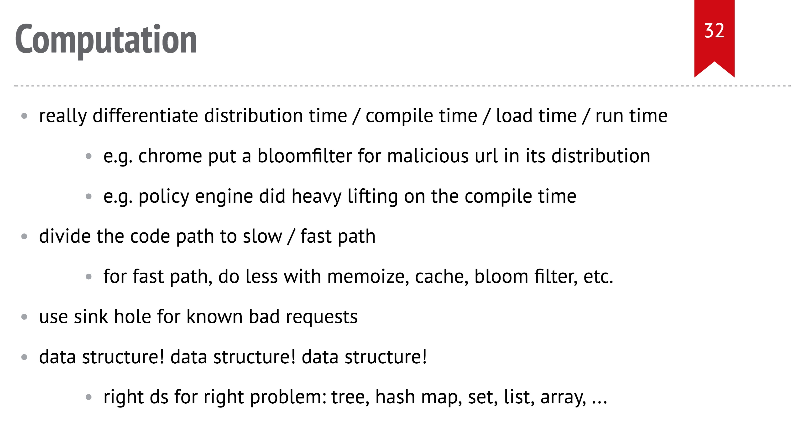

# 思考，快与慢

这篇文章和同名的书没啥关系，主要想再讲讲这幅图，因为有人问到。



## 路径分离

在我懵懂的时候，我的老东家 Juniper 的 ScreenOS 的设计给了我很多启发。防火墙是分 control plane 和 data plane 的，control plane 负责慢速处理，比如 UI，协议层的预处理，比如 IKE 的 phase 1 SA / phase 2 SA 的建立（这也不是绝对的，取决于应用场景），而 data plane 则一门心思负责流量的状态检查，过滤和转发。data plane 又根据需要，细分成了 first path 和 fast path，来最优化不同场景下转发的效率。

表面上看，control/data 及 first/path 的划分有些雷同，都是进行快速通道和慢速通道的分离，其实不然。

control plane 和 data plane 的关系，是 control plane 为 data plane 提供运行时所需要的数据。硬件上路径分离用得很6，比如路由器，一般而言 control 走 PCIE，data 走私有的 data channel。

有些协议，如 FTP / SIP， 也对 control 和 data 进行分离。

而 first path，则为同一个连接里的报文，生生构建出来一个优化的运行时（并存储在这个连接对应的 session 中）。如果把系统中数不胜数的功能点（函数）看作是一块块乐高积木，那么，first path 梳理出一系列对于这个连接而言，所必要的函数，并按顺序把它们组装起来（chain of responsibility），构建出这个连接专享的流水线。相同 session 的后续的报文，直接按照流水线上的函数一个个走，直至大功告成。__理论上__，设计完美的系统可以让生成的 fast path 没有任何一个分支，心无旁骛地从 A 点到 B 点走一个比激光还直的直线。

路径分离是一个非常重要的设计思想，它除了能够提高运行效率外，还将层次设计得非常分明，有效地避免了状态的纠葛，让上帝凯撒各奔前程。

比如说 rest API，几乎所有语言的 API framework 都设计成一个 middileware chain，开发者可以预先定义一整套 pipeline，来处理即将到来的 request。但这是死的 pipeline，没有根据 paid user / authenticated user / anonymous user 走不同的，定制的 pipeline。极致的情况下，我们可以在第一次建立 session 的时候，在 authentication 阶段为每个用户定义一个专属的，为其优化的 pipeline，预加载相关的数据，并放入缓存，让后续的访问直接进入快速通道。这种思路，加之其他 QoS 的举措，可以为系统中你所珍视的那些用户（一般是付费用户，或者是核心贡献者）提供最好的访问体验。

路径分离的潜在的问题是一开始我们都可以做出非常纯粹的，高效的设计，但随着功能的叠加，维护者如果不能秉承相同的态度，很容易产生妥协从而使得原本纯粹的解决特定场景的路径变得越来越「通用」，越来越臃肿，从而拉低运行的效率。

## 运行时分离

我在之前的 slides 里说，我们应该区分：package time，compile time，load time 和 run time。

package time - 软件打包时我们考虑为其预先生成哪些资源。

软件是可执行文件，配置和资源的集合。

什么是配置？配置是一种描述软件运行时所需要的参数的数据结构。通常，我们在服务部署的时候生成配置。

什么是资源？资源是一种离线生成的数据结构，它为软件的运行提供支持。游戏中的地图文件，文字处理软件的用于拼写检查的词典，都是资源的范畴。很多时候，系统中有些数据如果在线处理需要大量的运算，很难满足实时地访问，不如在离线状态下做些预处理，将其打包成某种资源，提高在线运算的效率。所以资源的生成和软件的可执行文件的生成可能在两个完全不同的 pipeline 里，然后将其一起打包。

合理地利用资源文件，能够让系统的运行时效率大大提升。在上文的 slides 里，我举了 chrome 里的 bloomfilter 的例子，这里就不重复了。

compile time - 在可执行文件的编译期，我们做哪些 transformation，来提升软件的效率。

典型的例子是 elixir 的 unicode 的处理和 plug 里的 router 的处理。

我们说说 plug router。elixir 下基于 plug 的 web server（比如 Phoenix）的 route match 的效率非常高，其原因就是如下的路由：

```elixir
get "/api/v1/route1", do: ...
get "/api/v1/route2", do: ...
get "/api/v1/route3/sub", do: ...
get "/api/v1/route3/:id", do: ...
```

被变换成了（pseudo code，非真实代码）：

```elixir
def match(:get, ["api", "v1", "route1"]), do: ...
def match(:get, ["api", "v1", "route2"]), do: ...
def match(:get, ["api", "v1", "route3", "sub"]), do: ...
def match(:get, ["api", "v1", "route3", id]), do: ...
```

然后又被 erlang VM 的 pattern match 功能解析成了一个等价于 trie tree 的结构。因而路由的匹配非常高效，且路由数量越多，url 的变种越多，效率越高，这和很多其他框架的路由系统，比如 node-restify / express 的基于正则表达式的线性匹配，效率高了很多。

如果你使用的语言在编译期可以做些事情，那么可以「浪费」这个阶段的时间，为运行时提高效率。我之前的文章：policy engine，便是这个思路。

下面说说 load time。

狭义的 load time 是指系统初始化。这个阶段慢一些也不紧要，我们可以做一些事情来加速后续的运算。比如说该设置的 pipeline，该加载的数据，该注册的 hook，event，甚至某些关键 cache 的预热，都可以在这个阶段完成。

广义的 load time 还包括数据的初始化的过程。

拿数据库中的某个数据举例。如果这个数据还没有加载过，那么第一次加载，是一次数据库的查询，得到原始的数据。我们通过对原始数据的变换，生成一个中间状态的数据，这个数据足够灵活，适合不同的应用场景，这是 load time 做的事情 —— 从冷数据到热数据，并且做相应的 transformation。之后不同的服务（或者客户端）请求，我们再根据具体的要求进一步做 transformation，得到最终的结果。这个结果我们可以对其做 memoize，下一次只要通过相同的参数访问，便可以近乎零的代价返回。

这样，整个数据加载和处理的过程我们将其细分成了一个 pipeline：load - initial transformation - final transformation - memoize。这样，第一次访问会走完整个 pipeline，之后的访问根据请求的不同，只走 memoize load 或者 transformation - memoize save 的流程。

## 把坏蛋关在笼子里

很多时候，我们费尽心力去优化正常访问的路径，或者说，合法用户的访问路径，却往往忽视恶意访问。我们做了 control/data，fast/slow path 的分离，构建了高效的 data pipeline，却没考虑不正常的访问可能会完整地走一个最慢的路径，从而无端消耗系统的计算资源。很多 DoS 攻击就是通过寻找系统这样的漏洞从而不对称地消耗目标系统资源。比如，访问 ``/api/v1/user/1234``，会返回一个 user profile，对于合法的用户 id，第一次访问会请求 db，并做很多处理，200ms 才能返回；之后再访问会命中缓存，10ms 就返回。而 ``/api/v1/user/1234858668881993`` 不匹配任何数据，在请求的中途异常返回，大概花 100ms，以后继续访问同样的 url，还要走相同的流程，几乎恒定在 ~100ms 左右返回。

这个时候，我们可以用 sinkhole 来解决。当非正常的访问抵达时，我们可以单独开辟一个缓存区，来存放它们的处理结果。这样，下次同样的异常请求到达，会命中缓存，从而立刻返回错误。

注意对于一个系统而言，异常的情形总是远多于正常的情形，所以我们要注意 sinkhole 不要吞噬太多原本就很宝贵的服务器资源。我们可以为异常状态设置阈值，比如说同样的异常访问出现三次以后，我们才创建 sinkhole，来捕获它；另外我们也可以为 sinkhole 设置上限，然后采用 LRU 算法来更替。

有时候，正常的访问抵达一个过载的系统也可以使用 sinkhole 来减轻过载服务的压力。如果我们明知某个服务不断返回 503（Service unavailable）/ 504（Gateway timeout），还继续转达客户端的请求，那么只会让服务质量更加恶化。更好的方式是，当错误达到某个阈值，立即创建一个有固定 timeout 的 sinkhole，在此期间，一切来自客户端的请求都被其吞噬，让过载的服务有机会恢复。

和「把坏蛋关在笼子里」对应的是，对进入系统的一切输入进行严格的过滤。

我在之前的一篇抨击 defensive coding 的文章中提到过，一个系统，我们要尽量让其内部纯粹和纯洁 —— 相信内部流转的数据的纯粹性（注意不是正确性）。而在内部系统和外部系统交织的地方，做严格的过滤：

* 服务请求的参数，除了类型严格检查外，其定义域也要和预设的定义域匹配，不匹配的一律过滤掉，不得进入系统。比如，系统的某个 id 取值区间是 6000000 - 90000000，那么，在这之外的 id 一律违法。
* 服务从外界读取的数据，一律严格校验。比如从数据库中读取，从文件中读取，从其他服务读取的数据，也要从类型和值域进行严格过滤。

如果能做到这样，大多数恶意的访问就能被扼杀在萌芽，不仅提升了系统的健壮性，还大大提高了系统的效率。
