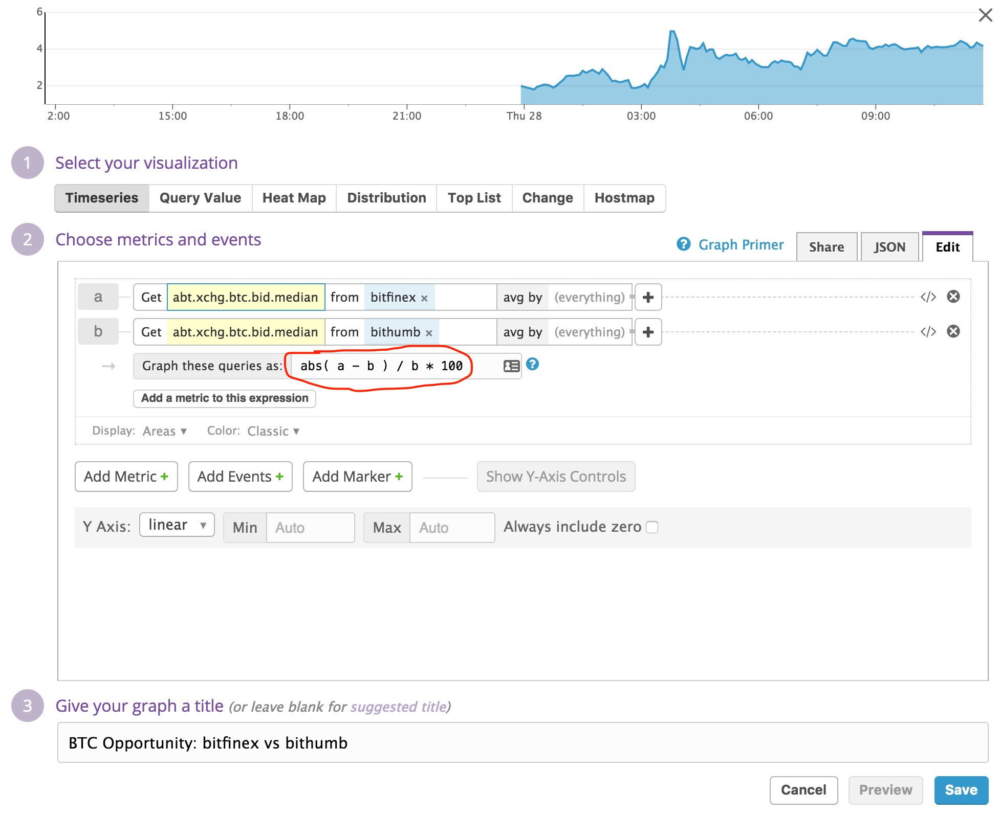
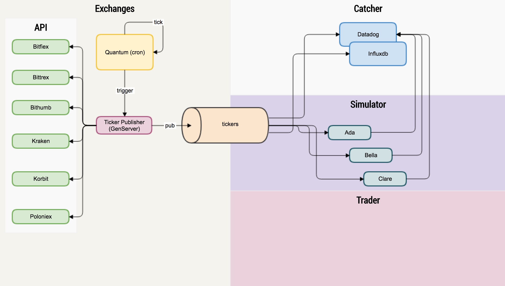
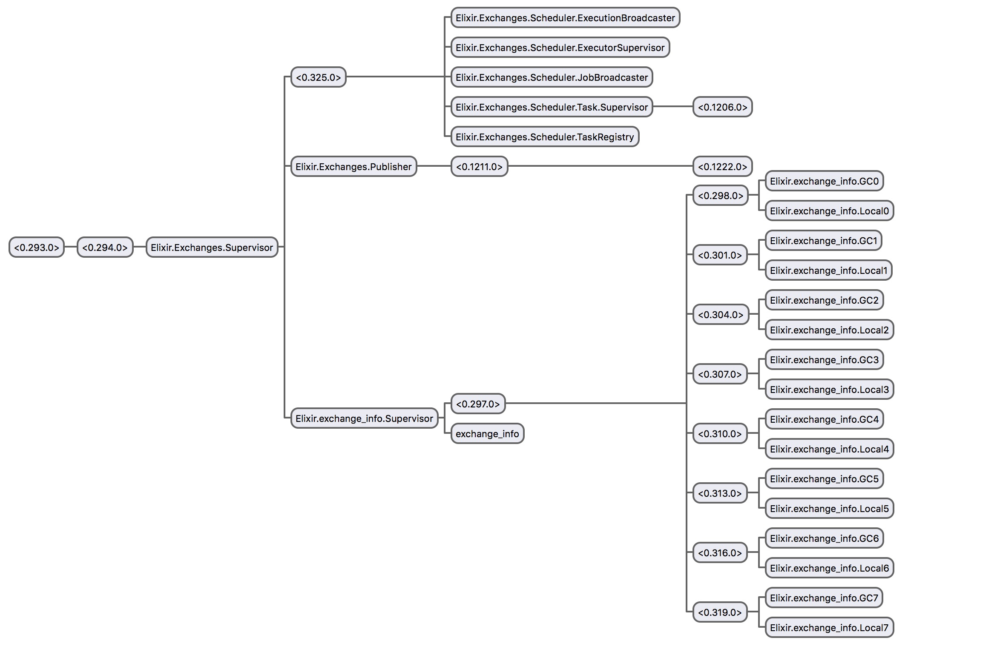

# 探索比特币量化交易套利的可能性

关于比特币套利交易的文章，坊间一搜一大堆，尤以 2014，2015 为甚。那时交易所间价差相当可观，套利的机会很多，躺着赚钱并非难事。如今，套利区间收窄，留在沙场上的估计只剩下大玩家，想要不费力气躺赢机会渺茫。最近帮朋友牵线寻找币圈量化交易的机会，本欲做个打酱油的中间人，事了拂衣去，安安静静做个三河市微胖界扛把子，谁料还是一时技痒，不小心昨夜搭进去六七个小时。

关于如何做套利交易，我就不赘述，大家可以看这篇文章，有内容有故事：https://daily.zhihu.com/story/4831821。

本文没有故事，只有技术和产品上的分析。

既然要做可行性分析，那么第一步就是观察交易数据。国内的交易市场虽然在政策要求下清场出局，国外的交易市场还算红火。从 bitfinex，kraken 一路到 bithumb，korbit 等，都提供 rest API，少量提供 websocket 接口。虽然文档欠缺，但这些接口都很简单，上手并不困难。

用 nodejs 小试牛刀后，我决定全面使用 elixir 重写。

这么做有几个原因：

1. 单就数据抓取来说，需要一些内部的 micro service。比如 bithumb / korbit 的报价是韩元，而其他都是美元。如果用美元统一，那势必要有一个稳定的内部 service 提供这种转换。erlang / OTP 的结构，天然呆萌，阿不，天然松散，各个 GenServer 自成一体，很适合这样的需求。
2. 数据的抓取和数据的处理我想分开来做。在定期从各个交易市场拿到数据后，我们可以使用 pubsub 结构把数据 publish 出去，然后让各个子系统去 subscribe —— 找交易机会的去算交易机会，做持久化的去写数据库，以后想到什么新的消费数据的姿势，随时可加入新的 subscriber。如果用别的语言，少不了再引入 ZeroMQ 这样的依赖（引入复杂性和其他问题）。erlang / OTP 有 process group，适合 pubsub，而 phoenix_pubsub 对此已精巧封装，开箱即用。
3. erlang / OTP 的容错和并发/并行能力能让效率大大提高。
4. because I can - Insider Man (2006)。

数据抓取出来后，可算出一些随着时间变化的，理论上的套利空间（真正做是另一回事），但数据本身太抽象，不足以打动自己，打动别人。比如说，过去 1 小时有 10 个大于 0.5% 的套利机会（扣除双边的手续费也就剩不到 0.1%），这样的机会究竟可行性如何，长得什么样，无从得知。

广东十大杰出青年方世玉他妈苗翠花说：__行走江湖，最重要的就是一个「颜」字__。干瘪的数字，枯燥的理论如同一具具骷髅，即便切中要害，也很难在产品汪和商务喵身上找到共鸣。所谓 __无图不丈夫__，不搞点 UI，整些可视化，金矿也会被掩埋在黄土之下。《奋斗》里陆涛他爹怕他对三十万元这样一个数字没有概念，叫人取出现银，装一大纸袋里给他，这就是可视化。

但构建一套扩展性好的可视化 UI 岂非一日之功？你好不容易整个 chart 支持 line / bar / area 和 multiple series，做着做着可能又要在两个 series 之间做四则运算，之后可能需要更加复杂的操作。本来涂脂抹粉装个大家闺秀就是个权宜之计，结果一入前端深似海，从此变更永缠身。所以，不到万不得已，别自己做可视化。我试过几个比特币套利交易的开源代码，UI 相当一般，扩展性很差，吃力不讨好。

不自己做，那谁来做？

平日里我工作，接触多的是 datadog。datadog 是做性能监控的，我们只管打点，存储和可视化交给 datadog。虽然它和量化交易八竿子打不着，但如果我们却可以把这颜值担当交给 datadog 来试试看。

打点很简单，写个 subscriber，监听爬下来的数据，然后这么写入 datadog：

```
arb.xchg.btc.bid:4182|h|#bitfinex
arb.xchg.dsh.bid:344.38|h|#bitfinex
arb.xchg.eth.bid:301.93|h|#bitfinex
arb.xchg.xmr.bid:97.762|h|#bitfinex
arb.xchg.xrp.bid:0.2023|h|#bitfinex
arb.xchg.zec.bid:299.22|h|#bitfinex
arb.xchg.btc.bid:4009.071877180739|h|#bithumb
arb.xchg.dsh.bid:330.42568039078856|h|#bithumb
arb.xchg.eth.bid:288.8171667829728|h|#bithumb
arb.xchg.xmr.bid:93.35310537334263|h|#bithumb
arb.xchg.xrp.bid:0.1936496859734822|h|#bithumb
...
```

我们为每个币种提供一个 metrics，以交易所的名字做 tag，一个 batch 把同一时间获取的数据 push 到 datadog。这样，我们就可以可视化出这样的结果：


很明显，就比特币来说，bitfinex 和 bithumb 间有足够的套利机会：


这个图是将两个 series 相减，其差异换算成百分比得到的，所以纵轴是百分之几。datadog 深耕于 APM 市场多年，对此在 UI 上已有支持，我们直接可以编辑操作，暖不暖心？



《让子弹飞》里张麻子问：什么 TMD 是以图服人？方世玉他妈的亲家公答：我这就是以图服人。现在套利的区间一路了然。我们看所有币种的机会：


机会有，但有没有可能兑现，是另一回事，不在本文讨论之列。而且目前只有少量的数据，还不充分。

看到这里我们再梳理一下这个系统的架构：



* 系统有四个 Application，Exchanges 负责抓取数据并 publish，Catcher 负责持久化数据（写入 datadog 或 influxdb），Simulator 负责模拟交易（目前仅考虑实时数据的模拟交易，以后应该考虑对历史数据模拟交易），Trader 则真正把一个个合适的机会转化为交易
* Exchanges 和 Catcher 已经基本实现，Simulator 考虑实现，Trader 再说
* Simulator 可以根据一些配置的条件动态生成交易员（有点像游戏中的 NPC），接受实时数据并寻找各自的交易机会（使用真实的交易手续费，以及模拟各种延迟），每当产生交易，交易的数据和交易后的总市值会 push 到 datadog，最后可以在 datadog 里生成一个实时群芳谱，看看 Ada，Bella，Clare，Daisy 一干人等究竟谁牛
* 系统的容错性不错，理论上任何部分 crash 都会自我修复，不会有致命影响（比如 publisher 挂掉，当前时刻没法出去的数据会丢，可能丢失一些交易机会）

下图是 exchanges_app 的 skeleton：



在 Catcher 里，我们除了把数据写入 datadog，还打算写入 influxdb，这是为何？我虽然很喜欢 datadog，但它的专长是 APM，数据的发送有很长的延时（默认 20s），也就是说你一个 batch 写进去的数据，先本地 UDP 给到了 datadog agent，agent 悠哉悠哉晾你一下，觉着差不多了，再发送给 datadoghq。这个延时对事后分析来说无伤大雅，但如果盯盘，就不那么舒服了。而 influxdb 完全由我们自己控制，不存在这个问题。这是其一。

我上次使用 influxdb / grafana 已是一年前，最近听人说起 grafana 也引入 alarm 的功能，正好这个项目可以把它们拾起来好好研究。influxdb / grafana 实时性比较好，可以让一些操作直接在 grafana 里完成，比如用查询语句寻找交易机会，然后 trigger 一个 alarm，alarm 的 endpoint 是一个 webhook，在 webhook 里进行交易。这样的话，发现交易机会的公式只要可以用 query 写出来，就不必写代码，大大增强系统的灵活性和可扩展性。这是其二。

目前总共撰写近 700 行代码，大约花费五六个小时。一些感悟：

* __善用工具__。有些工具，就像本文中的 datadog，从另一个角度去使用它，会有意想不到的收获。
* __我们的时间真的弹性很大，与其说「没有时间」，不如说「我没兴趣」，或者说「它不重要」__。昨晚从 7:30 算起，到凌晨1点多我睡，中间我有半个小时 1:1，以及一个多小时的 new hire training。平日里我如果花上两个小时和同事开会或者探讨问题，那么那晚我就会累得什么都不想做，早早上床休息。然而昨夜我硬是挤出时间精神高度集中地写代码。
* __合适的挑战可以勾起一个人的兴趣，然后一切就可以自然流动__。
