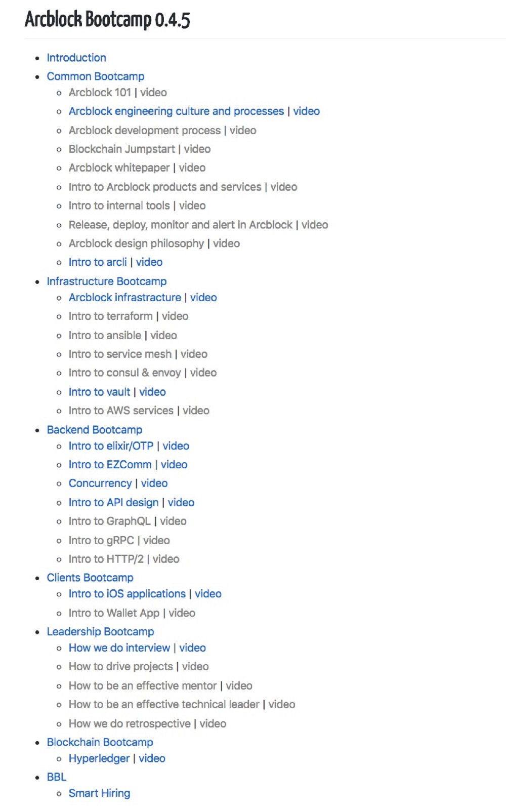
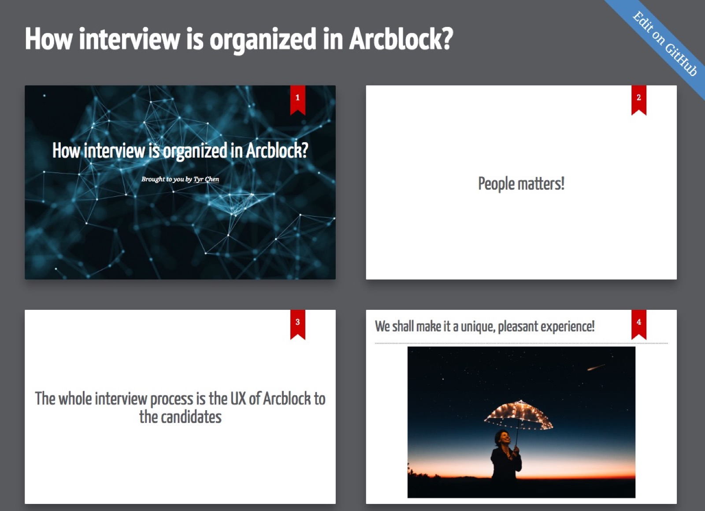
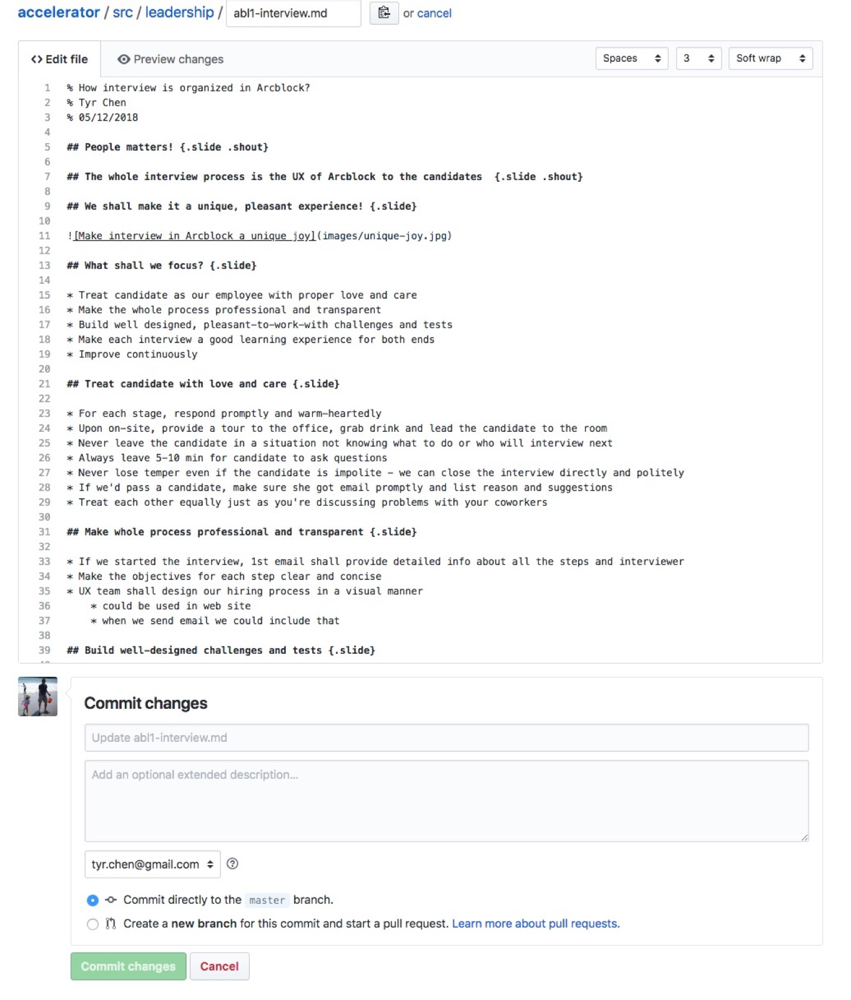
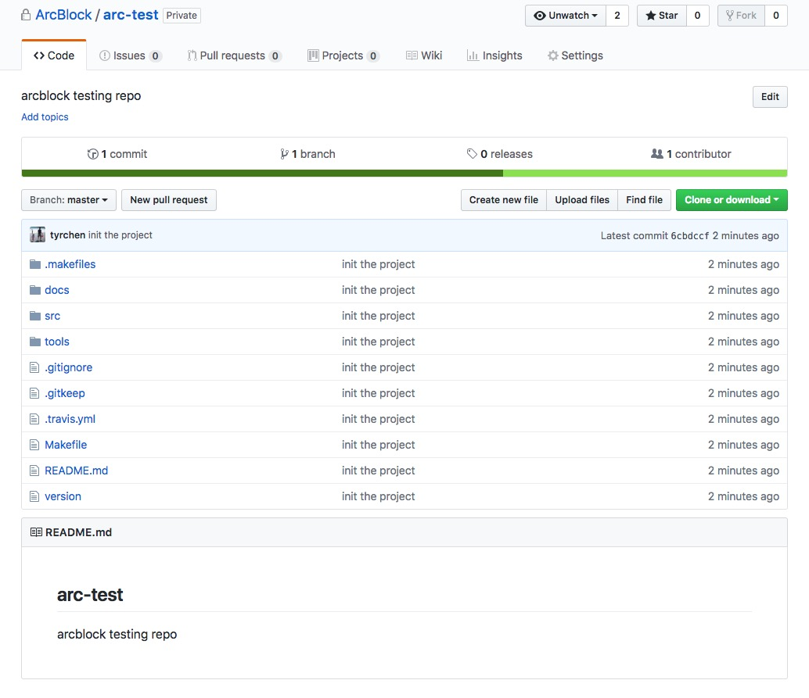
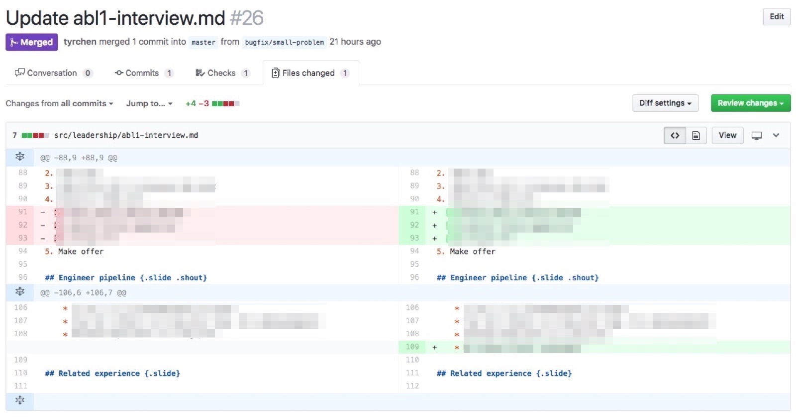

# Code is Law

如果你以为本文是在讲 Ethereum，或者 Smart Contract，那我非常抱歉。本文将要讲述的是 Engineering practices 以及我对一些流程的思考和应用。

## 先举一个栗子

在展开新工作的第一天，我就试图将 bootcamp 和 BBL 的文化引入 Arcblock。两周后，我们的 bootcamp site 长这个样子：



请原谅这个简单的 UI 一副舅舅不疼姥姥不爱的样子 —— 我们只是还没有精力去将其做得更加美观。我的偶像陈道明先生说：简约而不简单。这界面下面，其实蕴含着复杂的自动化流程。

如果要写新的 slides，团队里的工程师只需在我们的 bootcamp repo 里新建一个 markdown 文件，然后遵循一定的标准去撰写，就可以生成合适的 slides，比如：


again，先暂且不要在意简单的 UI —— 面包会有的，一切都会好的。你要在意的是，confidential 的页面和非 confidential 的页面，差异仅仅在一个预定义好的 css class：``.confidential``。

当你完成了 slides 的编撰，``make create-pr``（之后会介绍）会自动更新这个 repo 的版本，创建一个 pull request。

这时，勤劳的 travis 便会开始工作，把 slides build 一遍，确保无误后，给一个 green light。然后，reviewer review 后，merge PR。勤劳的 travis 会再度出现，先是把当前的版本打一个 tag，然后创建一个 github release，然后再把 slides 部署到一个 host static website 的 S3 bucket 上。这就是你开头看到的那幅图 —— 注意标题中的版本号。

整个流程的 UX 对 arcblock 的工程师来说，清晰，简单，并且是 day-to-day work，没有任何额外的入侵性的工作要做 —— 而且，系统帮你能简单就简单，连手工更新版本号，创建 pull request 这种工作，都只需要一条命令完成。

如果只是改一点点文字，觉得流程还是略繁琐，你还可以 inline edit（注意下图右上角的 label）：



然后你可以不用命令行，直接编辑并创建 PR：



PR merge 之后，网站就得到自动更新了。

## 为什么说 Code is Law？

当我工作得越久，我越发感觉到流程的自动化和易用，非常非常重要。大家都知道 security best practice，都了解 key rotation 的重要性，但没有人真正去实施，为何？太繁琐，需要记住的条条框框太多，流程自己害死了流程。然而好的流程往往自身已经优化到不可精简的地步 —— 着粉则太白，施朱则太赤 —— 这个时候，我们唯一可依赖的就只有代码。通过代码，我们可以固化流程，通过代码，我们可以在保持流程完备的情况下，让流程的 UX 尽可能简单而没有入侵性。

在 Arcblock，上面的例子仅仅是沧海一粟。我们很多做事的方法，都在最大程度地践行和优化 Code is Law。我们的开发流程有如下要求：

* 所有的改动必须有 pre commit hook —— 代码的风格和静态检查，代码编译，单元测试，文档的自动生成都必须通过，才能 commit
* 所有的改动必须发 pull request，要 up to date，CI 通过，有至少一个 review 才能 merge
* 每个 PR 的 merge 必须是 squash merge，不能是 rebase 或者  merge
* 每个 PR 必须 bump version，在 merge 到 master 之后，必须要有相关的 changelog，并且创建一个 github release
* 如果是编译型的语言，编译后的结果要放在对应的 github release 上
* 如果是 static web site，生成的结果要放在对应的 S3 bucket 上，可以直接访问

这些事情如果都是手工去做的话，非常费事，会让工程师叫苦不堪 —— 自然，会有聪明的工程师想办法将其自动化。然而，更进一步的问题出现了 —— 不同的 repo 里自动化的机理可能不一样，在不同的 repo 工作有学习成本和上下文切换成本。

于是我们问自己一个的问题：可不可以构建一个体系，让所有的 repo 尽可能长得一样，拥有相同的能力？

从产品设计的角度来说，这个面向工程师的产品应该是个 CLI，它应该可以这么交互，来帮助工程师生成新的 repo：

```bash
$ arcli create:repo
? Repo name: arc-awesome-repo
? Please write concise description: Awesome repo in arcblock
? Choose a template: (Use arrow keys or type to search)
❯ elixir
  general
  nodejs
  python
  web
```

为什么使用 interactive CLI，而不是带参数的 CLI？因为我们不想加重工程师记忆的负担 —— 第一次使用它的工程师也能无障碍的使用。当然，如果在其他程序中调用，我们也支持把所需的数据以 JSON 的形式直接 pipe 给 ``arcli create:repo``，以符合 UNIX 文化。

这个自动生成的 repo 会有以下 layout，并且自动生成这些文件和目录：



如果你在生成的 repo 下看看 make 的能力：

```bash
$ make <tab>
watch           dep             precommit
all             deploy          release
browse-pr       doc             run
build           init            test
bump-version    install         travis
clean           lint            travis-deploy
create-pr       post-build      travis-init
delete-release  pre-build
```

你会惊异地发现，很多基础的工具，都已经立等可用。你可以用 ``make create-pr`` 去做 pull request，可以 ``make browse-pr`` 打开 browser 查看当前 repo 的 pull requests，可以 ``bump-version``。此时此刻，你的第一个 travis build 应该已经 build 完了并且 all green —— 这个时候，你还没有写真正的代码，然而，整个世界已经串起来，滚滚前行。

单拎出 ``make create-pr`` 来说，当一个 PR 创建出来的时候，工程师需要干三件事：改软件的版本号，commit，写 changelog，去 github 上创建 PR。``make create-pr`` 在命令行里将所有这三件事都做了：

```bash
$ git commit -a -m "my awesome commit"
$ make create-pr
Bump version...
-e  Current version: 0.2.0
-e  Latest commit hash: cca0f8c
-ne  Enter a version number [0.3.0]:
[feature/test 53e617d] bump version
 4 files changed, 9 insertions(+), 3 deletions(-)
remote: Resolving deltas: 100% (4/4), completed with 3 local objects.
To github.com:ArcBlock/arc-test.git
 * [new branch]      feature/test -> feature/test
https://github.com/ArcBlock/arc-test/pull/1
```

如果你的项目有需要预先安装的软件，可以将其置于 ``init`` 下，其他用户下载 repo 后可以直接 ``make init``，就生成一个完全可用的开发环境，而非阅读长篇累牍的 "how to install"。

如果项目需要让 travis deploy，可以放在 ``travis-deploy`` 下，而 ``.travis.yml`` 会引用这个 make target。

任何一个工程师，只要学会了一个 repo 的使用方法，其它 repo 都是一模一样，真正的 learn once, run everywhere。

对于工程师来说，上面的繁杂流程简化成几条命令：

```bash
$ arcli init:repo # 第一次使用，以后不需要，会调用当前 repo 下的 ``make init``
$ arcli start:story # 选择一个 story 开始工作 - 会自动 git check -b feature/<story-id>/<title>
$ git commit
$ arcli create:pr # 生成 PR，并且自动生成一个 version bump 和 changelog.md update 的 commit
```

这大大增强了流程的易用性。

使用代码来实施流程有如下好处：

* reuse：某个流程的实现可以被复用到其他地方
* compose：流程和流程可以组合
* compile：流程可以从一种结构被 transform 成另一种结构
* configure：流程可配置，可松可紧，可萝可御
* extend：流程可以被继承并拓展
* debug：流程可以很方便地 debug
* test：流程可以 test
* version：流程有其自己的版本号
* document：流程有和代码在一起的文档

当然，还有代码的最大的好处：快速迭代。当我发现问题后，就可以立刻修改并且发送 pull request，让同事参与进来讨论。我们前几天完成了 interview process 的流程的制定，昨天讨论之后，就有一些 PR 发出来：




__现在请你停下来，仔细想想这样的迭代速度多么地可怕。__

__再想一想。__

我们常常说不要让流程僵化，人人都可参与，人人都可修改，然而，当你的公司的流程是贴在墙上的一张张纸，躺在邮箱里的一个个 PDF，你怎么去参与？怎么去修改？跟 HR 反馈？跟哪个 HR 反馈？我认识的哪个 HR 管这个么？如果修改怎么修改？修改流程的流程是什么？当这么多疑问摆在眼前，你会放弃。而一个 github repo 放在那里，你只要会用 markdown，几分钟就修改好了，merge 之后，几分钟之内该 build 成 pdf build pdf，该放在内网上就放在内网上，你不用关心，你的工作几乎能够立刻得到反馈 —— 并且，就像区块链一样，你的名字被永远地写进了这次修订之中。

人人都说 lean startup，谁都知道 build - measure - learn 的 feedback loop —— 天下武功，唯快不破，说的也是这个 loop 的迭代速度要快。然而这个 loop 光靠吹是吹不快的，要靠好的机制，要靠 code。

还拿 interview 为例，昨天面试一个 data engineer，她给我们的 code test 提了些建议，我回头仔细想了想，很有道理，于是就在 clubhouse 里提了这么一个方案（还没有实现）：

```bash
$ arcli create:code-test
Please choose a role: Data Engineer
Please choose a test: General
Please set expiration (1-7 days, default 7): 7
Please put the github id for the candidate: tyrchen

Code test is genearted for candidate tyrchen. Temporal link (expire in 7 days): https://....
Github repo is generated for candidate tyrchen. It will be merged into arcblock/arc-archived-code-tests upon expiration.
```

基本上，就是当我们要给一个 candidate 发 code test 时，我们可以选择相关的角色和试题，生成 github repo，生成关于试题的临时访问地址，然后通过邮件或者微信通知对方链接。这样，试题的说明我们可以随时更新，而不需要邮件或者微信上来来回回口头阐述 —— 而口头阐述是 conversation-based，很容易失真，很容易即兴发挥而引导对方到错误的方向。

arcli 也是我们 Code is Law 思想的一种体现。我们说我们的一个原则是内部的各种工具最好统一易用。那么对应的需求是：

* CLI 的界面要一致
* CLI 能够很方便地被发现
* CLI 是 interactive 和 self-document，能够轻松上手

所以我花了点时间用 commander 和 inquirer 写了个自注册的 CLI 的 framework（别被这个名头唬住 —— 整个 core 也就不到 100 行代码），同时做了一个 CLI 模板，可以自动生成新的 CLI 的整个 layout，最后填充执行的 action 即可。

```bash
$ arcli create:arcli
? name of the cli (use ":" to differentiate action and object. e.g. create:repo): hello:world
? Please write concise description: hello world
Creating target index.js with file index.js.tpl.
Creating target cli.js with file cli.js.tpl.
Regenerateing /Users/tchen/projects/arcblock/arcli/src/cli/hello/index.js
Regenerateing /Users/tchen/projects/arcblock/arcli/src/cli/index.js
Code generated at: /Users/tchen/projects/arcblock/arcli/src/cli/hello/world
```

这样，当一个工程师需要创建某个自动化工具时，她可以很方便快捷地创建，并专注于其逻辑而不是 CLI 如何注册，如何被发现，如何设置和选择参数等等。

而我们内部也在不断讨论，如何让这些工具和流程能够更加人性化，让体验是一种 peak experience：


我们知道，如果一家公司口口声声说 user centric，give user love and care，内部的流程却处处反人性，并没有 user centric，那么如何让员工去 love and care user？如果一家公司拍着胸脯说每个员工都是公司的 leader，却根本不给予 leader 们合适的工具去行使 owner 的权利，那这和没有说有什么区别？在哈佛幸福课里，Tal 用生动的例子向大家证明，people don't follow what you say, but follow what you do。

所以，在 Arcblock，Code is Law。我们用代码来表述流程，我们用 github 来记录流程，用 travis 来编译和部署流程，用开源代码合作的方式来进化流程。而所有这一切，我们希望不仅仅工程师受益，整个公司都能受益；不仅仅工程师能 PR，其它职能部门的人，我们也会教会她们 markdown 和 github 的简单用法，从而无障碍地使用和更新。

想想看，如果有一天，公司流程变了 —— 所有 PPT 的模板要换做一组新的 UI， 所有的 doc 要换新的 logo，你那些所有的历史文档怎么办？

而在 Arcblock，这仅仅是在几个地方修改样式表，然后 PR，然后 merge 的事情。

Code is Law！
