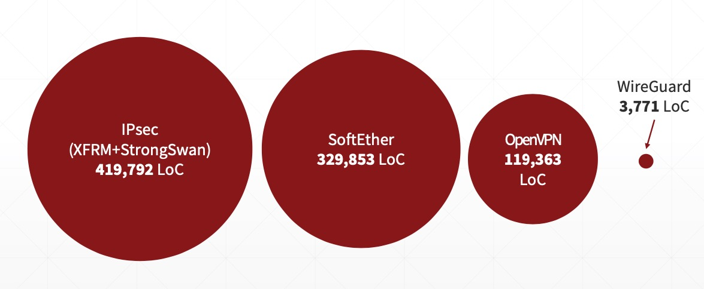
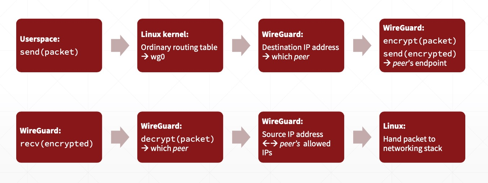
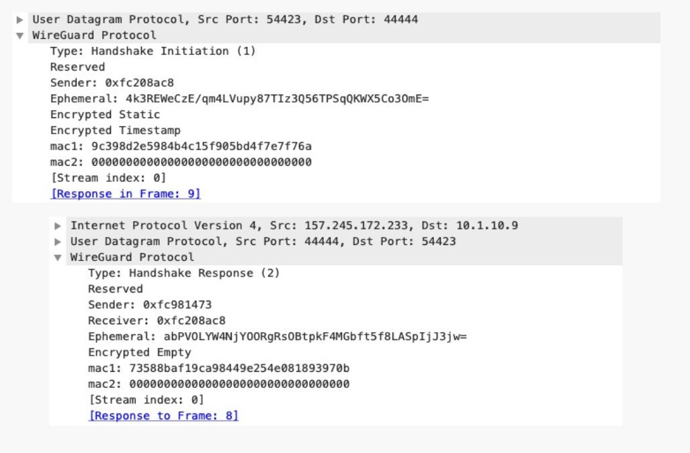

# Wireguard：简约之美

本文共 4300 字，普通阅读需要 10 分钟，精读需要 30 分钟。

最近团队内部的 BBL，我分享了 Wireguard。Wireguard（以下简称 WG）作为新一代的 VPN 的代表，可能很多做技``术的同学都不陌生。和其它 VPN 技术一样，我们可以使用它在家庭网络和公司网络之间搭建一条安全的信道，由此可以访问「内网」的数据和应用。

在具体讲 WG 之前， 我们先来把 VPN 的通用需求抽象一下：

- 安全性（security）：保证两个私有网络间的数据可以在不安全的网络（比如互联网）上安全地传输

- 真实性（authenticity）：访问者是合法的用户，访问者访问的是正确的网络

- 高效性（efficiency）：开启 VPN 并不会让访问网络明显变慢，且建立隧道的速度要快

- 隐秘性（stealthiness）：第三方并不能轻易嗅探到网关的存在

- 易用性（accessibility）：很容易配置，很容易开启和关闭

在不安全的网络上安全地传输数据这件事，我们必须感谢 Martin E Hellman，Bailey W Diffie 和 Ralph C. Merkle。他们的专利 [Cryptographic apparatus and method](https://patents.google.com/patent/US4200770) 提出了后来广为流传的 DH 算法，用于交换密钥。


这个算法本身使用了同余和乘法交换律的性质，过程很简单，大家感兴趣可以看 wikipedia。WG 使用的 ECDH 则是 DH 算法的变种，使用了椭圆曲线来增强性能和安全性：


通过 DH 算法，网络的两端可以在不安全的网络中协商出来用来加密要传输的数据的密钥。之后，数据流就可以用这个密钥进行高效地做对称加密。

安全性解决了，那么，如何解决网络两端身份验证的问题？这个问题目前的通解是两个：

1. 共享密钥（pre-shared key）

2. 证书（certificate）

比如我们访问招商银行的网站，浏览器通过验证招行的证书来确保我们要访问的网络的确是我们要访问的网络。而当一家公司的总部的网络和分支机构的网络要通讯时，可以预先配置彼此的公钥然后通过数字签名来验证彼此，这是共享密钥的一种变体（纯粹的共享密钥不满足前向安全，几乎不应该被使用在通讯中）。

安全性和身份的真实性问题解决了，VPN 最重要的问题也就解决了。我们现在使用的 VPN 解决方案，无论是工作在网络层的 IPSec VPN，还是工作在会话层的 SSL/TLS/OpenVPN，在密钥交换和身份验证都并没有跳脱出前面讲述的算法。它们之所以那么复杂，很大程度在于配置的处理，加密算法的协商和各种兼容性问题上。而本文的主角 WG，虽然从算法的角度并没有太多创新，但通过巧妙地组织需求和另辟蹊跷地实现，产生出一种让人窒息的简洁。

以下是代码量的对比：



WG 仅有 4k 的内核代码实现！精巧得简直不能再精巧！虽然这么说有些不敬，但对比下来，仿佛 OpenVPN 或者 StrongSwan 是按行收费的印度外包公司的产品，而 WG 是真正的程序员的杰作！Linus 本尊对 WG 赞不绝口，他在 18 年 8 月 2 日的 [一封邮件](https://lists.openwall.net/netdev/2018/08/02/124) 这么写到：

> Btw, on an unrelated issue: I see that Jason actually made the pull request to have wireguard included in the kernel.

> Can I just once again state my love for it and hope it gets merged soon? Maybe the code isn't perfect, but I've skimmed it, and compared to the horrors that are OpenVPN and IPSec, it's a work of art.

> Linus

要知道，Linus 平日来评论代码的画风是这样的（Mauro 是一个 Kernel maintainer）：

> "It's a bug alright -- in the kernel. How long have you been a maintainer? And you _still_ haven't learnt the first rule of kernel maintenance?

> "Shut up, Mauro. And I don't _ever_ want to hear that kind of obvious garbage and idiocy from a kernel maintainer again. Seriously.

所以能让 Linus "state my love" 比登天还难。所以让我们怀着朝圣的心情，跪着学习 WG 是怎么做到的 —— 这样做产品写代码的思路值得我们潜心研习！

## WG 接口的概念

首先从概念说起。

很多人做产品并不太在意去清晰地解释产品中存在的诸多新老概念，尤其是不敢创建新的概念。这是非常错误的做法。我们在开始架构设计的时候，就应该把产品的所有概念梳理清楚，并且当现有的概念不能很好地描述产品的某部分时，要勇于创建新的概念来使其描述足够完备。概念是工程师之间，以及工程师和外界沟通的基础，通过大家一致认可的概念去沟通，更精确，更高效。比如当我上文赋予 ECDH 是 DH 算法使用椭圆双曲线的一种变体这样一个概念后，我再提及 ECDH，就不必费劲重新解释一下。当我们产生一个新的概念后，我们可以将很多属性附着于这个概念之上，使其区别于其它概念。

WG 先定义了一个很重要的概念 —— WireGuard Interface（以下简称 wgi）。为什么要有 wgi？为什么现有的 tunnel 接口不适合？一个 wgi 是这么一个特殊的接口：

- 有一个自己的私钥（curve25519）

- 有一个用于监听数据的 UDP 端口

- 有一组 peer（peer 是另一个重要的概念），每个 peer 通过该 peer 的公钥确认身份

通过定义这样一个新的接口，wgi 把它和一般的 tunnel 接口区分开。有了这样一个接口的定义，其它数据结构的挂载，以及数据的收发都很清晰明了了。

我们看 WG 的接口配置：

```ini

[Interface]

Address = 10.1.1.1/24

ListenPort = 12345

PrivateKey = blablabla


[Peer]

PublicKey = IWNVZYx0EacOpmWJq6lE8RfcFBd8EeUliOi+uYKQfG8=

AllowedIPs = 0.0.0.0/0,::/0

Endpoint = 1.1.1.1:54321
```

WG 的 VPN 隧道的发起者（initiator）/ 接收者（responder）是对等的，所以也没有一般 VPN 的客户端/服务器端或者 spoke/hub 的区别。因而配置也是对等的。

在这个配置中，我们进一步了解了 peer 这个概念：它是 WG 节点的对端，有静态配置的公钥，peer 背后的网络的白名单（AllowedIPs），以及 peer 的地址和端口（这个并不一定需要，并且随着网络的漫游，可能会自动更改）。

仅仅 9 行配置，我们就描述了一个最简单的 VPN 网络。这个配置里没有没完没了的证书的配置，没有非常复杂，长达上百行不知所云的内容，也不用设置 CA。如果你不幸配置过 IPSec VPN 或者 OpenVPN，那你该感慨简洁真的是第一生产力。

从数据结构的角度来看，wgi 下面挂一张 peer 的哈希表，和一张密钥索引（key_index）的哈希表。通过接收到的数据报文中的 key_index，我们可以立刻定位到 peer，而每个 peer 下面存储 endpoint 的状态，协议握手的状态，以及 keypairs（三组：当前正在使用的密钥，上一次 rekey 前使用过的密钥，rekey 后下一次即将要用的密钥），而每组 keypair 又包含接收和发送两个方向的 keypair。

在 wgi 接口使能的情况下（wg-quick up wg0），wgi 会被初始化，进而其相关的 peers 也都会被创建出来；反之（wg-quick down wg0），wgi 会被停止运行，相关的 peers 会被删除。数据结构的脉络非常清晰明了。

## 加密信道协商的过程

WG 的简洁设计还体现在加密隧道的协商上。它使用了 Noise Protocol Framework 来构建协议的协商过程。Noise Protocol Framework 是一个设计精巧的用来构建安全协议的框架，这里我们就不展开来讨论，之后我会撰文另行介绍。WG 使用了 Noise_IKpsk2_25519_ChaChaPoly_BLAKE2s，从协议名字你大概能猜到它选取 curve 25519 做 ECDH，ChaChaPoly 做对称加密，Blake2s 做哈希，在 IKE/SSL/TLS 协议中，这些算法都是两端协商出来的，WG 觉得没必要，直接将其固定在协议中，所以大大减少了需要支持的加密算法，以及节省了加密算法的协商过程。因为网络的两端都配置了对方的公钥，因而它可以仅仅使用 1-RTT（一组来回的报文），2 个报文，就完成隧道的建立。看看 IPSec 使用的 IKE 协议，main mode 下 6 个报文（3-RTT），aggressive mode 下也需要 3 个报文（2-RTT）。北京到西雅图，1-RTT 大概 175ms (cloudping.info)，2-RTT 就会有非常明显的延迟。对于任何协议来说，减少协商隧道的 RTT，可以大大增强协议的性能。

1-RTT 也意味着无连接（connection-less），因为相互之间没有确认。大家可以对比有连接的 TCP（三次握手确认 ~~眼神~~ 连接）和无连接的 UDP。有连接的网络有无数好处，但无连接胜在简洁，就像一条记忆只有七秒钟的鱼，没有过去，现在和未来的负担。

对于有连接的协议，一般来说，需要有个状态表存储之前协议进行到哪里了。这个状态表是动态生成的，很容易成为 DoS 的标的。比如 TCP，从诞生之初就饱受 SYN-flood 之苦。而无连接，则没有这个负担 —— 服务器不必为了客户端的握手请求而特定做些什么，也不用考虑丢包（丢包就重新握手好了，反正就 1-RTT），不用起定时器管理连接表中的半开连接（因为压根没有）等等。

WG 的握手报文中会携带：

- unencrypted_ephemeral：发送方为这次握手临时生成的公钥（未加密，用于 ECDH）

- encrypted_static：用对端公钥和临时生成的私钥 ECDH 出的临时密钥 key1 对称加密对方的公钥

- encrypted_timestamp：用对端公钥和自己的私钥 ECDH 出 key2，key2 混淆进 key1，来加密当前的时间戳

- mac1：对端公钥加上整个报文内容后的哈希

接收方先校验 mac1（简单的身份验证 - 一般的黑客在这一步就跪了），如果不对，直接丢弃；之后验证 encrypted_static（确认眼神 - 除非有私钥，否则黑客在这一步也跪了），验证 encrypted_timestamp（防止重放，所以重放攻击也跪了）。当接收方校验一切 OK 后，它可以生成自己的临时密钥对。此时，接收方因为有了对端的临时公钥，已经可以计算出此次协商后加密数据要用的密钥。但它还需要发送一个握手的回复报文来把自己的临时公钥给发送方以便于发送方可以算出同样的密钥：

- unencrypted_ephemeral：接收方为这次握手临时生成的公钥（未加密，用于 ECDH）

- mac1：对端公钥加上整个报文内容后的哈希

这样两端都有对方临时生成的公钥，加上自己临时生成的私钥，就可以 ECDH + HKDF（一种把 DH 结果转成对称加密密钥的方法）得到这次握手的两个方向的对称加密的密钥。

如果这个过程有丢包，比如接收方没有收到发送方的握手请求，或者发送方没有接收到握手回复，那么整个过程重来就好了。反正怎么着都是 1-RTT，不浪费。

这个过程 WG 还充分考虑了隐秘性，接收端只要是收到不合法的握手（比如 peer 我不认识，重传等），就直接丢弃。在发送方看来，握手的报文就像进入了一个黑洞，因而除非黑客能够得到 WG 网关的授权将其公钥添加为 peer，否则几乎没办法嗅探到接收端的存在。而其它 VPN 协议的隧道建立阶段，比如 IPSec 的 IKE 协议，OpenVPN 的 SSL/TLS 协议，都可以被嗅探到。

## 数据报文的发送和接收

有了密钥之后，用户的数据报文就很好处理了。处理的逻辑非常简单清晰，以至于寥寥数行就可以涵盖：

- 发送：

- 用户态：应用程序发送目标地址是 VPN 对端网络的数据报文

- 内核：内核通过路由表发现应该由 wg0 接口发出，所以交给 WG 处理

- WG：通过目标地址，在接口的配置中可以反查出要发往哪个 peer，然后用之前和该 peer 协商好的密钥（如果没有协商或者密钥过期，则重新协商）加密报文，并将报文封装在目标地址和目标端口是 peer 的 endpoint 的 UDP 报文中（报文中包含 key_index）

- 接收：

- 内核：数据报文的 UDP 端口是 WG 在监听，将其送给 WG 处理（WG 的 recv 得到该报文）

- WG：从报文的 key_index 找到哈希表中对应的密钥，解密（这里不是直接解密，而是放入一个解密队列中，这是设计上网络系统的一个小诀窍）

- WG：查看解密出来的原始报文是否在 peer 允许的 IP 列表中，如果是，就把原始报文交给内核处理。注意，这里这个报文属于哪个 peer，也是从 key_index 中获得

- 内核：根据原始报文的目标地址查路由表将报文送出



## 太干了，来点湿的？

在 BBL 里，我做了这样一个演示：用我本机和 DigitalOcean 上的一台机器建立 WG VPN，然后发一个 HTTP GET，服务器端返回一个带有 hello world 的文本。以下是 wireshark 的抓包，我稍作注释：




## 延伸阅读

1. WireGuard Protocol: https://www.wireguard.com/protocol/

2. Noise Protocol: https://noiseprotocol.org/

3. Authenticated Encryption with Associated Data (AEAD) algorithm - RFC7539

4. HKDF: https://tools.ietf.org/html/rfc5869

5. DH 算法的专利：https://patents.google.com/patent/US4200770

6. WireGuard 源码：https://github.com/WireGuard/WireGuard

7. Linus 的邮件：https://lists.openwall.net/netdev/2018/08/02/124

## 贤者时刻

作为一个曾经常年混迹网络及安全协议的老兵，WireGuard 带给我的震撼是全方位的。它就像一记重锤，狠狠地砸在我头上：如果懂得合理取舍，简化各种繁文缛节，复杂如 VPN 协议，也可以如此清丽脱俗；简单的，考虑周到的用户接口（配置）意味着易用的产品和大智若愚的设计；由此带来的简洁会让很多接下来随之发生的很多事情变得简单：因为接口简单清晰，所以几乎一切数据结构都可以预先生成，因为协议本身简单（1-RTT），所以任意一段发起重新协商也很简单；握手过程丢包？丢就丢吧，反正握手很快很方便；最终，因为简单，所以代码量少，没有那些个弯弯绕绕，一个对 C 和 linux 开发比较熟悉的工程师，随便花上一个下午就能把主流程看个明白 —— 这也就意味着代码更容易审核，写测试代码花费的时间更少还更容易做到更高的测试覆盖率，更难出错，bug 更少，解 bug 的时间更少，留给程序员深思熟虑展望未来的时间也就更多，当然也就无需 996，节约下来的时间或陪老婆孩子愉快玩耍，或找三五知己一起读读书，听听音乐会，聊聊天，都是很好的。

<!--


我们熟知的 TCP 三次握手，是不考虑隐秘性的典范。


The output from the AEAD is twofold:


* A ciphertext of the same length as the plaintext.

* A 128-bit tag, which is the output of the Poly1305 function.

就好像我们画画，现有一个轮廓，然后勾勒细节，细节越丰富，它的表现力就越强。

-->
