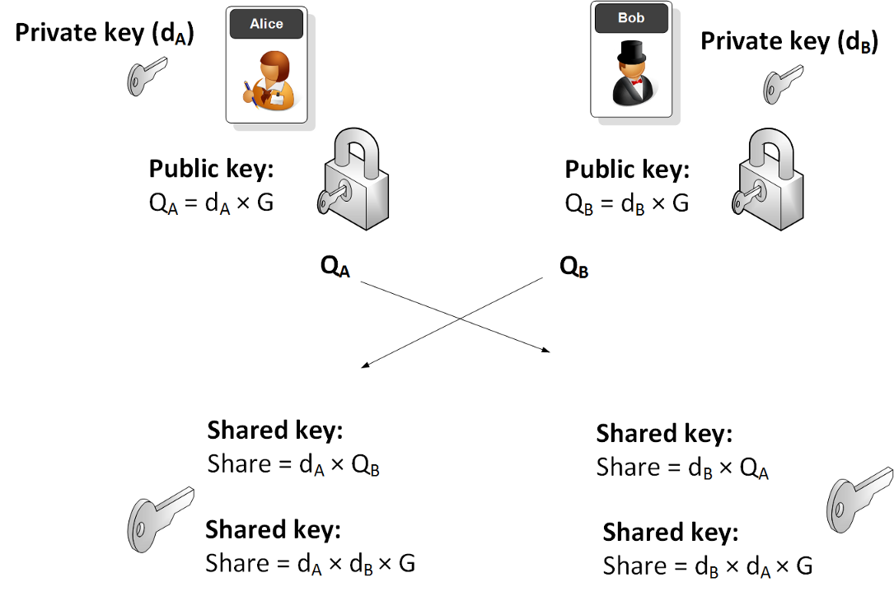
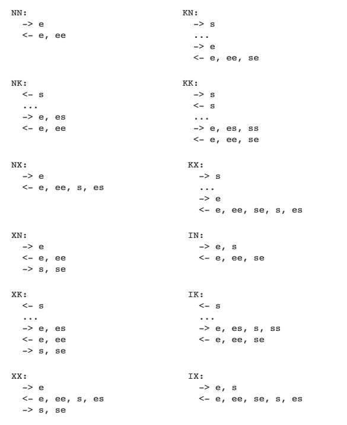

# Noise 框架：构建安全协议的蓝图

Noise Protocol Framework（以下简称 Noise）是一个用于构建安全协议的框架。与 TLS，IPSec 这样的有完整实现的协议不同，Noise 更多像是一个蓝图，它为那些想创建自己的安全协议的开发者提供了一套模板。就好像元编程之于编程，Noise 是协议的元协议（meta-protocol）。

诸君也许会问：既然有了 TLS，我们为何还需要创建自己的安全协议？

虽然 TLS 1.3 相对于前作，已经放弃了很多对老旧的算法的支持，整个协议栈也更加清爽更加「现代」，握手的过程只需要 1-RTT（甚至 0-RTT），这些观点都和 Noise 倡导的方向不谋而合，但使用 TLS 必然牵扯 PKI，需要服务器端证书和客户端证书（可选），而证书需要 CA（无论是公共的 CA 还是私有的 CA） 发放，整个协议栈还是非常复杂，且很难应用到非中心化的 p2p 网络中。

所以，当我们想开发一些直接基于 TCP 或者 UDP 的私有协议时，TLS 颇为笨重，并不是最好的选择，而自己开发的安全协议不一定靠谱，这时，Noise 就是一个安全灵活的选择。

我们在之前讲 WireGuard 的文章中提到过安全信道建立的基石是 DH 算法，即协商安全信道的双方，持有一个私密的随机数，然后交换公开的随机数，通过同余算法两端独立计算出相同的密钥，从而达到不传输密钥就可以协商出相同密钥的方式。DH 算法的一个高效安全的变种是 ECDH：

如果我们要开发自己的安全协议，DH/ECDH 是几乎无法避免的。协商出来密钥之后，我们需要考虑使用什么样的对称加密算法和哈希算法，如何验证双方的身份，如何保证前向安全性（现在使用的密钥泄露不会导致过去使用的密钥泄露），如何在收发两个方向上 rekey（密钥使用一段时间后重新生成新的密钥）等等。这些令人头疼的问题，Noise 协议都做了严格的规定。

## 鸟瞰 Noise 协议

我们先要明确一件事情：Noise 协议虽然其初衷是为网络协议提供安全信道，但它并没有规定使用什么样的通讯协议 — TCP / UDP 甚至是任何满足 read / write 接口的子系统，比如文件，管道（pipe），都可以使用 Noise 协议。

```mermaid
graph TD
application --> noise
noise --> application
noise --> ReaderWriter
ReaderWriter --> noise
```

Noise 协议原文除去附录，有 41 页之多，这里面有大量的概念和协议细节的描述，在深入细节之前，我们从用户的角度，或者说产品的角度，看看如何使用一个 Noise 协议做出来的系统。

首先是协议的握手。在握手阶段，发起者和应答者（initiator / responder，注意 Noise 没有使用 Client / Server，但我们可以简单认为 initiator 是 client，而 responder 是 server）通过交换信息对使用何种算法，密钥是什么达成一致。

握手阶段双方需要使用同样的协议变量 —— 和 TLS 不同的是，Noise 把协议变量设计为静态而非协商出来的。这是一个很大的简化，而从用户的角度，用户写出来的使用 Noise 的应用往往是自己的节点跟自己的节点通讯，因而无需协商。我们上次讲到的 WireGuard 使用的是这样的变量：Noise_IKpsk2_25519_ChaChaPoly_BLAKE2s。稍微解释一下：

* I：发起者的固定公钥未加密就直接发给应答者
* K：应答者的公钥发起者预先就知道
* psk2：把预设的密码（Pre-Shared-Key ）放在第 2 个握手包之后
* ChaChaPoly：对称加密算法
* BLAKE2s：哈希算法

协议变量各个部分是这样规定的：Noise _ <握手的模式> _ <公钥算法> _ <对称加密算法> _ <哈希算法>。其中握手模式有很多种，适用于各种不同的场合。其中IK 模式的握手方式是这样的，只需要 1-RTT，我们随后细讲：

```mermaid
sequenceDiagram
Initiator ->> Responder: e, es, s, ss
Responder ->> Initiator: e, ee, se
```

握手的过程中，Noise 会生成一个 HandshakeState，它用来记录当前收到的对端传来的固定公钥和临时公钥，以及通过 ECDH 算法算出来的临时数据。当整个握手结束后，双方都有对等的信息，可以生成一致的密钥。于是发起者和应答者对于它们各自的接收端和发送端生成密钥对。

之后，Noise 允许用户将协议状态切换成传输模式（Transport Mode）。切换过程中，HandshakeState 转换成 CipherState，然后就可以用 encrypt / decrypt 来加密和解密应用的数据了。

理论上讲，Noise 的用户接口可以就这么几个：

* `build`：根据协议变量和固定私钥，初始化 HandshakeState。
* `write(msg, buf)`: 根据当前的状态，撰写协议报文或者把用户传入的 buffer 加密
* `read(buf, msg)`：根据当前的状态，读取用户传入的 buffer，处理握手状态机或者把用户传入的 buffer 解密
* `into_transport_mode`：将 HandshakeState 转为 CipherState
* `rekey`：在传输模式下，用户可以调用 rekey 来更新

对于用户的应用程序来说，这个接口无比简单，很容易和现有的系统串联起来。从产品的角度，简单不仅仅意味着美，还意味着很难用错。

## Noise 协议握手细节

Noise 协议的核心部分是握手协议，它总共支持 12 种不同的协商的模式。这些模式可以进一步和 PSK，非对称加密算法，对称加密算法，哈希算法排列组合出数百种不同的协议变量。当然，核心就是这 12 种。每个模式都由两个字母标识，第一个字母代表发起者，第二个字母代表应答者：

其中：

* N：表示自己没有固定公私钥
* K：表示自己的固定公钥对方预先知道（通过其他途径）
* X：表示自己的固定公钥通过网络加密传输给对方（用于身份隐藏）
* I：表示自己的固定公钥明文传输给对方（不考虑身份隐藏），I 状态只会出现在发起端

有了这些概念，我们就好理解每种模式的含义 —— 比如：KX。接收者预先知道发起者的固定公钥，而接收者的固定公钥通过网络加密传输给发起者。因为接收者预先知道发起者的固定公钥，意味着发起者通过某个渠道将其固定公钥 s 在握手之前就发送给了接收者。这就是上图中 `...` 前面的 `-> s` 的意思。`...` 之前的动作都代表预先发送，并不包含在握手之中。

我们接着看 `e, ee` 这些字符代表什么。如果是单个字符，代表箭头方向接收到对方传来的公钥。`s` 是固定公钥，`e` 是临时公钥；如果是两个字符，则代表做 DH 运算 —— 第一个字符代表自己的公钥，第二代表对方的公钥。我们来解释一下 XK（为了便于区分，我们把对端的公钥前面加一个 r，表示 remote）：

* `<- s`：接收方的固定公钥预先提供给了发送方
* `...`：之前的消息是握手阶段就已经完成的消息，属于先验知识
* `-> e, es`：发送方发送自己临时生成的公钥 e，然后用自己的临时公钥 e 和对方的固定公钥 s 做 DH(e, rs)。接收方收到 e 之后，也可以做 DH(re, s)。
* `<- e, ee`：接收方发送自己临时生成的公钥 e，然后做 DH(e, re)；发送方收到对方发来的 e 之后，做 DH(re, e)。
* `-> s, se`：此刻双方已经可以生成一个临时的密钥，发送方用其加密发送自己的固定公钥，然后再做 DH(s, re)；接收方收到对方的 s 后，做 DH(rs, e)。
* 至此，协商结束

XK 是 Noise 里面路径最长的握手模式，其它模式都是 1-RTT。关于 XK（或者其他模式）的安全性分析，可以在 Noise Explorer 里探索，这里就不详述：[https://noiseexplorer.com/patterns/XK/](https://noiseexplorer.com/patterns/XK/)。

Noise 整个握手的过程每次 DH 并不是孤立的事件。从建立 HandshakeState 那一刻起，Noise 就维护一个 chaining key，每次运算的结果都会反映到 chaining key 之中。至于握手过程中 chaining key 是如何计算的，协议的状态机是如何维护的，可以参考 Noise Spec，我就不重复解释了。

## Noise 协议的应用

WireGuard 算是目前最成功的公开的应用。因为 Noise 协议主要应用在提升私有协议的安全能力上，所以很多应用并不为公众所知。根据 官方的 WhatsApp Encryption Overview 文档，Whatsapp 端到端的消息加密使用了 Noise 协议。比特币的闪电网络也使用了 Noise 协议。rust-libp2p 应用了 Noise 协议，这也意味着，polkadot，substrate 以及 facebook 的 libra 也（潜在）使用 Noise 协议。

此外，Noise 协议还可以用于加密文件 —— 只要我有你的公钥，我可以使用单向握手（7.4）加密某个文件（附带握手时发送的消息），然后传输到某个不安全的位置（比如网盘，FTP，IPFS，甚至区块链中），该文件只有拥有私钥的人才能解密。这种应用很有意思，因为它具备非对称加密的安全性，同时又具备对称加密的加解密速度。

如果你对 noise 协议感兴趣，rust 下的 snow crate（程序君验证过），golang 下的 libdisco（未验证） 和 flynn/noise（已经两年未更新）看上去都不错。尤其是 rust 下的 snow，实现精巧，很容易和其它模块如底层的 tokio/async-std，以及上层的 yamux 结合使用​。snow 在不少开源项目中，尤其是区块链和 IoT 的项目中​得到广泛使用。​
